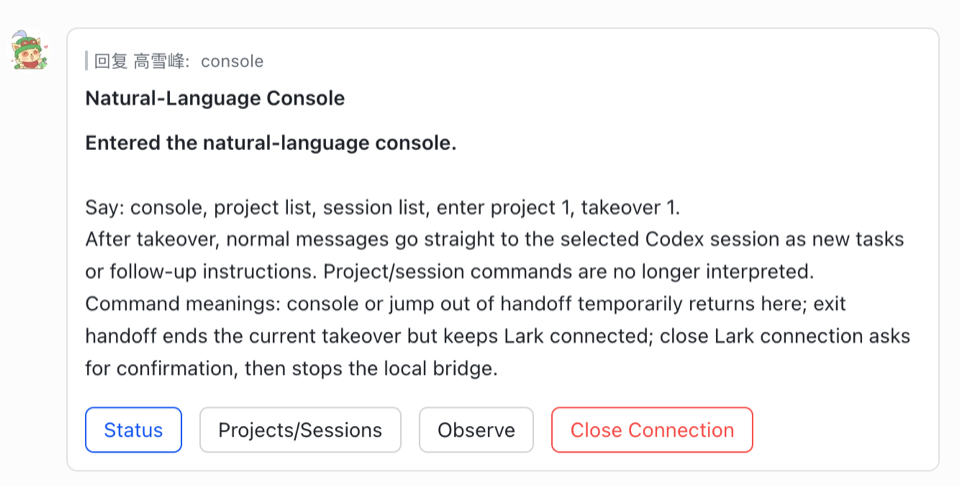

# Lark Remote

Control and take over local Codex sessions from Feishu/Lark.

Chinese version: [README.zh-CN.md](README.zh-CN.md)

Marketplace page: [codex-lark-remote](https://www.codex-marketplace.com/plugins/codex-lark-remote)

This repository is the `gxfn` Codex plugin marketplace. The installable plugin
bundle lives in [`plugins/codex-lark-remote/`](plugins/codex-lark-remote/).
The repository root keeps a full README so first-time users can understand the
product before opening the bundled plugin docs.

Bundled plugin docs:

- [English plugin README](plugins/codex-lark-remote/README.md)
- [Chinese plugin README](plugins/codex-lark-remote/README.zh-CN.md)
- [Technical architecture guide (Chinese)](docs/technical_architecture.zh-cn.md)
- [Cross-thread takeover design (Chinese)](docs/cross_thread_takeover_design.zh-cn.md)
- [Feishu natural-language intent translator design (Chinese)](docs/intent_translator_design.zh-cn.md)

## Overview

Lark Remote connects Feishu/Lark to local Codex sessions on your Mac. Start the
local bridge from Codex, then use Feishu/Lark as a control console to choose a
project, inspect sessions, observe progress, or take over a selected session.

The default experience is intentionally narrow:

- Start the bridge from a trusted Codex conversation.
- Use the Feishu/Lark console as the main entry point.
- Choose a local Codex project and session.
- Observe read-only progress or take over that session.
- After takeover, send normal messages to the selected Codex session.

The Codex conversation that starts the bridge can be attached as the first
target, but the plugin is not limited to that one conversation. Target selection
is controlled from Feishu/Lark after the bridge is connected.

## Start With The Console

The Feishu/Lark side has one main entry point: the natural-language console.
After the bridge is connected, send `console` or click the console button on
the startup card.

<p>
  
</p>

Console display language is bound per Feishu/Lark chat. Enter with English to
keep later console cards in English; enter with Chinese to keep them in Chinese.
Sending a control phrase in the other language switches that chat's later
display language.

In the console, use short phrases:

```text
console
project list
session list
open project 1
observe session 2
takeover 1
```

The same controls also work in Chinese, such as `控制台`, `项目列表`,
`会话列表`, `进入项目 1`, `观察会话 2`, and `接管 1`.

When you take over a Codex session, the chat switches to direct task mode.
Ordinary Feishu/Lark messages are then sent straight to that Codex session as
new tasks or follow-up instructions. They no longer go through project/session
intent routing.

To temporarily return to the console, say `console` or `jump out of handoff`.
To end the current takeover but keep the Feishu/Lark bridge connected, say
`handoff off` or `exit handoff`. To stop the local bridge and disconnect
Feishu/Lark, say `close Lark connection`; the bot asks for confirmation first.

## Daily Flow

1. Install the plugin and configure the Feishu/Lark app once.
2. In Codex, start Lark Remote to connect the local bridge.
3. In Feishu/Lark, enter the console and choose a project/session.
4. Take over the session, then send normal coding requests.
5. Use `console` when you need to choose another project or session.

## Install

First-time users do not need to clone this repository.

### Option A: Codex Marketplace CLI

Install the approved marketplace artifact:

```bash
npx codex-marketplace add GxFn/codex-lark-remote/plugins/codex-lark-remote --plugin
```

To pin the exact reviewed release:

```bash
npx codex-marketplace add https://github.com/GxFn/codex-lark-remote/tree/v0.2.2/plugins/codex-lark-remote --plugin
```

Then restart or refresh Codex if the plugin list does not update immediately.

### Option B: Codex Desktop GitHub install

If Codex asks for a GitHub target or direct artifact path, use the plugin bundle
path, not the repository root:

```text
https://github.com/GxFn/codex-lark-remote/tree/v0.2.2/plugins/codex-lark-remote
```

If the Codex dialog separates source, ref, and sparse path, fill it like this:

```text
Source:
https://github.com/GxFn/codex-lark-remote.git

Git ref:
v0.2.2

Sparse path:
plugins/codex-lark-remote
```

Enable `codex-lark-remote` from the plugin list after installation.

### Option C: Add this repository as a marketplace

This repository also includes `.agents/plugins/marketplace.json`. If you want to
add the whole `gxfn` marketplace instead of the single plugin, use:

```text
Source:
https://github.com/GxFn/codex-lark-remote.git

Git ref:
v0.2.2

Sparse path:
leave empty
```

Use `main` instead of a tag only if you intentionally want the latest unreleased
changes.

## Configure Feishu/Lark

For first-time setup, use this path:

1. Create the Feishu/Lark bot app.
2. Copy App ID and App Secret to the clipboard.
3. Return to Codex and say `copied` or `已复制`.
4. Codex reads the clipboard, saves config, and runs `codex_lark_check_auth`.
5. Codex runs `codex_lark_verify_setup` to start/reuse the bridge and confirm
   that WebSocket is connected.
6. In Feishu/Lark Open Platform, click verify/save on the Event Configuration
   and Callback Configuration pages.
7. Return to Codex and explicitly approve connecting this Codex conversation to
   Lark Remote.
8. After Codex confirms the connection is active, send `whoami` to the bot from
   Feishu/Lark.
9. Add the returned `senderId` to `lark.allowedUsers`, then use the console.

Create the Feishu/Lark bot app:

1. Open [Feishu Open Platform](https://open.feishu.cn/) or
   [Lark Open Platform](https://open.larksuite.com/).
2. Create an internal/custom app.
3. Enable the bot capability.
4. In **Credentials & Basic Info**, copy **App ID** and **App Secret**.
5. In **Event Configuration**, choose long connection/WebSocket and subscribe to
   `im.message.receive_v1`.
6. In **Callback Configuration**, choose long connection/WebSocket and subscribe
   to `card.action.trigger`. Keep Codex Lark Remote bridge running when you
   click Feishu/Lark's verify/save buttons.
7. If you switch to webhook mode, configure
   `/bridge/lark/event` as the callback URL and keep verification token /
   encrypt key in sync.
8. Add the message receive, send/reply, and card interaction callback
   permissions requested by the platform, then publish or enable the app for
   your tenant.

`codex_lark_verify_setup` is mainly for first-time setup, reconfiguration, and
troubleshooting. It reports whether credentials work, whether the bridge is
running, whether WebSocket is connected, and whether the plugin has actually
received `im.message.receive_v1` message events and `card.action.trigger` card
callbacks. You do not need to run it repeatedly during normal use.

Copy App ID and App Secret to the clipboard. If you do not know your sender id
yet, leave `allowedUsers` empty for this first private setup. The clipboard can
use this shape:

```text
Feishu/Lark app:
- appId: cli_xxx
- appSecret: xxx

Allowed users:
- allowedUsers: []

Optional takeover tuning:
- takeover: { projectLimit: 20, selectionTtlMs: 600000 }

Optional startup intro:
- startup: { receiveId: "oc_xxx", receiveIdType: "chat_id", once: true }
```

After copying it, return to Codex and say `copied` or `已复制`. Codex reads the
clipboard, calls `codex_lark_configure`, then runs `codex_lark_check_auth` and
`codex_lark_verify_setup`. Do not send App Secret to a Feishu/Lark group chat.
After the Feishu/Lark Event Configuration and Callback Configuration pages are
verified and published, return to Codex and explicitly approve connecting the
current conversation.

The plugin stores private runtime config in:

```text
~/.codex-lark-remote/config.json
```

Do not commit that file.

After Codex confirms the current conversation is connected to Lark Remote, send
`whoami` to the bot from Feishu/Lark, then paste the returned `senderId` back
into Codex and ask it to update `lark.allowedUsers`. Project/session takeover
stays blocked until `allowedUsers` is non-empty.
The `whoami` reply includes an `allowedUsers: ["..."]` line you can paste back
directly.

`startup.receiveId` is an optional proactive target. When configured, the bridge
sends a startup intro card after the first successful Feishu/Lark
connection or handoff activation. When it is not configured, the first allowed
Feishu/Lark message supplies the current `chat_id`, receives the intro once,
and becomes the default target for later bridge starts. If card delivery fails,
the bridge falls back to a text intro. The sent marker and last remembered chat
are stored in `~/.codex-lark-remote/startup-notice.json`; set `startup.once` to
`false` while debugging if you want the intro every time.

When `appId` or `appSecret` is missing, the plugin does not start the bridge and
does not attach the Codex conversation. It returns setup guidance instead.

## Start From Codex

From a trusted Codex conversation, ask:

```text
Start codex-lark-remote.
```

Codex asks for explicit consent before storing local routing state for this
thread in the local bridge. Existing chat history is not sent to Feishu/Lark.
After you confirm, the plugin starts the bridge and opens the Feishu/Lark
console.

When a specific Codex thread is attached, handoff is strict about that
session/window. The plugin uses the exact thread id or session path supplied by
Codex when the tool is called. Feishu/Lark can later choose another allowed
project/session from the console.

On macOS, the bridge starts `caffeinate -dimsu` while handoff is active so the
Mac can turn the display off without going to sleep. It stops that keep-awake
process when handoff is turned off or the bridge stops.

## Take over Codex sessions from Feishu/Lark

Feishu/Lark controls target selection with `takeover` or `windows`.
Full-project takeover requires `lark.allowedUsers`; if the
allowlist is empty, the bot refuses to list projects or execute takeover.

The bot first replies with a project list from local Codex session records.
Choose a project to open every Codex session/window in that project, including
the session that started takeover. This is based on `~/.codex/sessions`; it is
not a macOS window enumeration. Then use **Observe** for read-only progress
streaming or **Takeover** to confirm handoff. If cards are unavailable, reply
with `1`, `2`, `3`, etc. to choose a project, then choose a session, then send
`takeover now`. Active sessions enter pending takeover and attach after the
current turn finishes.

## Observe another Codex session

Observation is read-only and separate from handoff. Use `observe` to list
observable Codex sessions, then `observe <number>` or
`observe <thread-prefix>` to stream progress from the selected session
into Feishu/Lark. Messages you send in Feishu/Lark are not routed into the
observed session. Use `observe off` to stop that stream.

## Output behavior

The Feishu/Lark replies are optimized for remote coding:

- Final Codex answers are sent back as normal text.
- Long answers are split into multiple Feishu/Lark messages instead of being
  truncated.
- Progress replies do not include internal task ids by default.
- Normal shell commands and `Output:` are hidden by default.
- Use `commands on` or say "show commands" to enable command display.
  Use `commands off` to hide them again.
- Potentially risky commands are always shown with a `Warning:` line, even when
  normal command display is off.
- When command display is on, command `Output:` is still limited to one
  high-signal line with line/character counts when more content was omitted.
- Source inspection output from commands such as `cat`, `nl`, `sed`, `grep`, and
  ordinary `rg` searches is summarized instead of dumping large code blocks.
- Secrets in command text are redacted before they are sent to Feishu/Lark.

This keeps Feishu/Lark focused on what Codex did, what changed, and what needs
attention.

## Permission boundaries

Lark Remote takes over the conversation stream, not the native Codex
Desktop UI. Feishu/Lark cannot click permission dialogs, MCP approvals,
sandbox-escalation prompts, network/install approvals, or other native Codex UI
popups.

When Codex hits one of those boundaries, the bridge and prompt contract ask the
agent to send a clear Feishu/Lark message instead of waiting silently. The
message explains what permission is needed and whether you must approve it in
Codex Desktop on the Mac or can reply in Feishu/Lark with explicit text consent.

## Mid-run guidance

If you send another Feishu/Lark message while Codex is still working, the plugin
does not try to hot-inject text into the already running Codex process. Instead,
it stores the message as supplemental guidance for the same handoff thread,
acknowledges it in Feishu/Lark, and runs it as the next turn as soon as the
current turn finishes.

## Mac keep-awake

The default handoff config keeps the Mac awake during remote takeover:

```json
{
  "handoff": {
    "keepAwake": true,
    "keepAwakeCommand": "caffeinate",
    "keepAwakeArgs": ["-dimsu"]
  }
}
```

Set `handoff.keepAwake` to `false` in `~/.codex-lark-remote/config.json` if you
prefer to manage sleep manually. This feature only runs on macOS.

## Troubleshooting

If Codex says the `codex_lark_*` tools are not available, the plugin MCP server
was not loaded in that conversation. Refresh or re-enable the plugin, then start
a new Codex conversation. Normal startup should use the plugin MCP tools, not
local shell script fallbacks.

If `status` shows `websocket disabled`, verify that `appId` and
`appSecret` exist in `~/.codex-lark-remote/config.json`, then start handoff
again from Codex.

If Feishu/Lark replies twice to the same message, check for an older local
bridge process or duplicate plugin installation and stop the stale one before
starting again.

If Codex writes files into the plugin cache, start the handoff from the Codex
conversation whose working directory is the project you want to edit.

## Sync To GxFn Marketplace

After publishing or refreshing the plugin, sync its installable plugin root into
the aggregate `GxFn/GxFnCodexMarketplace` repository:

```bash
npm run sync:gxfn-marketplace
```

Use `npm run sync:gxfn-marketplace:push` to copy, commit, and push the
marketplace snapshot. Set
`GXFN_CODEX_MARKETPLACE_DIR=/path/to/GxFnCodexMarketplace` if the marketplace
repository is not checked out next to this repository.

## Local development

For local development, register this repository as a local marketplace:

```toml
[marketplaces.gxfn]
source_type = "local"
source = "/absolute/path/to/codex-lark-remote"

[plugins."codex-lark-remote@gxfn"]
enabled = true
```

Run tests before publishing:

```text
npm test
```
