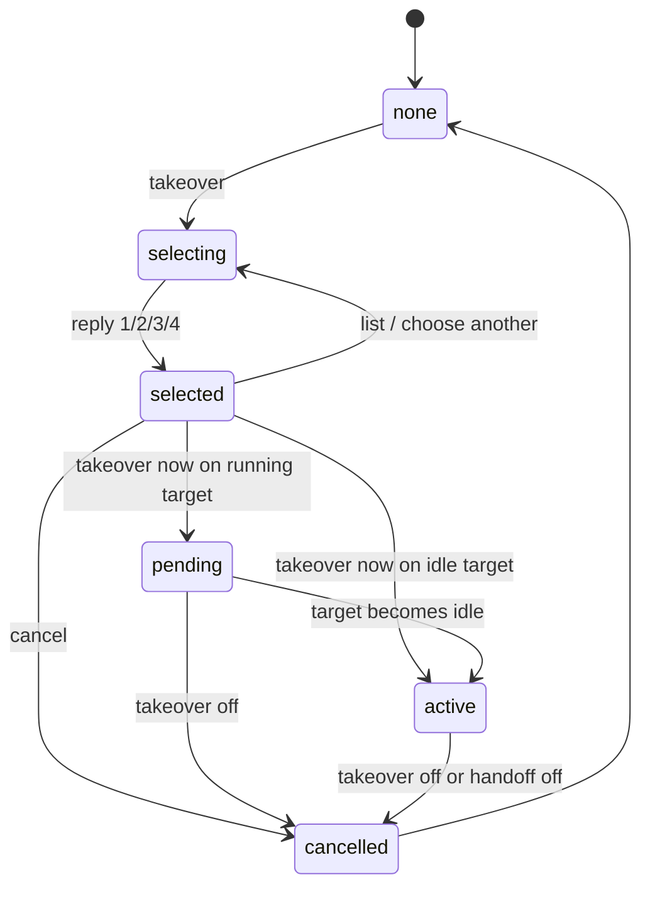
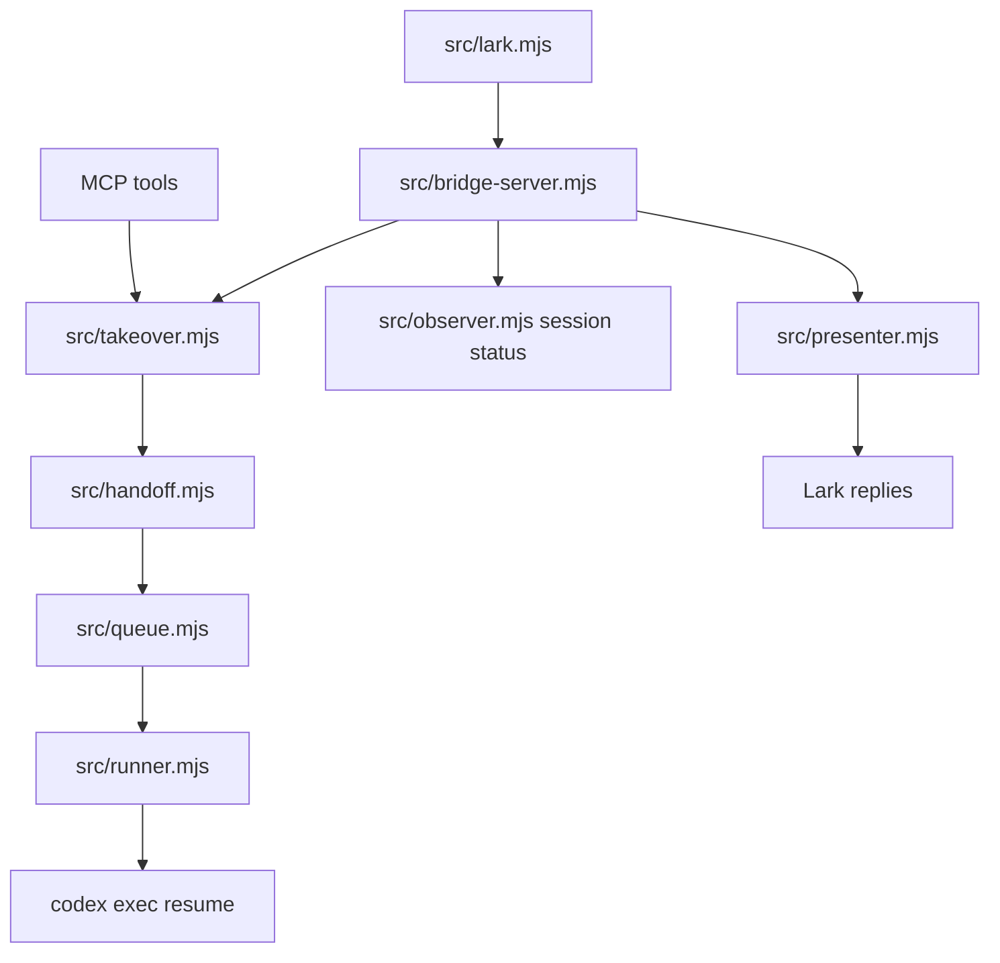

# 跨对话串流接管设计方案

日期：2026-05-13

## 当前实现状态

这份文档最初设计的是“从同项目 B 对话接管 A 对话”。当前实现已经升级为飞书/Lark
端全项目接管：

- `takeover` 和 `windows` 先展示本机 Codex 项目列表。
- 用户进入项目后，再看到该项目下所有 Codex 窗口，包括启动飞书接管的窗口。
- 全项目接管必须配置非空 `lark.allowedUsers`，且所有项目、窗口、观察和接管动作都
  会校验飞书用户身份。
- 卡片按钮采用“进入项目”“观察”“接管”“确认接管”的中文两级流程；文本数字输入是
  兜底交互。

下文保留早期设计推导，其中“同项目候选”应按当前实现理解为“项目列表 -> 项目内窗口”
的两级选择。

## 背景

当前 `codex-lark-remote` 的接管路径要求用户在“要被接管的 Codex 对话 A”里启动 `codex_lark_handoff`。如果 A 正在执行一轮较长任务，用户必须等 A 当前轮结束，才能在 A 的对话框里启动 Lark 插件。这在真实远程编程场景里很不方便：用户往往正是因为 A 在跑长任务，才想打开另一个 Codex 对话 B 来做远程接管准备。

期望的新体验是：

1. A 正在同一个项目里执行任务。
2. 用户在同一个项目里打开新的 Codex 对话 B。
3. 用户在 B 里启动 Lark Remote，并在飞书/Lark 中看到可接管的 A。
4. 如果 A 仍在执行，飞书/Lark 可以先进入 pending takeover 状态，但不会接收、暂存或补发补充输入。
5. 等 A 当前轮结束后，bridge 自动把 pending takeover 激活为 A 的 handoff。
6. 激活后，飞书/Lark 的普通消息继续进入 A 的同一个 Codex 线程。

这份文档给出实现方案。它不直接改代码，而是作为后续开发的技术蓝图。

## 外部资料调研

### Codex CLI session resume

相关资料：

- [OpenAI Codex CLI 文档](https://developers.openai.com/codex/cli)
- [openai/codex `exec` CLI 源码](https://raw.githubusercontent.com/openai/codex/main/codex-rs/exec/src/cli.rs)
- [openai/codex `exec` 实现源码](https://raw.githubusercontent.com/openai/codex/main/codex-rs/exec/src/lib.rs)

调研结论：

- Codex CLI 支持非交互执行：`codex exec`。
- `codex exec` 支持 JSONL 输出，插件当前依赖 `--json` 解析进度和最终回答。
- `codex exec resume` 可以恢复指定 session/thread，并附带新的 prompt。
- 当前项目已经在 `buildCodexResumeArgs` 中使用这一能力：

```text
codex exec \
  --ignore-user-config \
  --sandbox <sandbox> \
  -C <cwd> \
  resume \
  --json \
  --skip-git-repo-check \
  -o <outputFile> \
  <threadId> \
  <prompt>
```

跨对话接管不需要新的 Codex CLI 能力；关键是安全地发现 A、判断 A 是否仍在 running、等待 A idle 后再执行同样的 `resume`。

### MCP 工具接口

相关资料：

- [Model Context Protocol schema](https://modelcontextprotocol.io/specification/2025-11-25/schema)

调研结论：

- 插件通过 MCP `tools/list` 暴露工具，通过 `tools/call` 执行工具。
- MCP 工具调用携带请求上下文，当前项目通过 `applyCodexContext` 从上下文中提取当前 Codex thread id、session path 和 cwd。
- 对话 B 的 MCP 上下文只能精确代表 B，不能天然代表 A。因此跨对话接管必须通过“会话发现 + 用户选择 + 等待 A 结束”来建立 A 的显式绑定。

### Feishu/Lark 接收和回复

相关资料：

- [Lark SDK 文档](https://lark-sdk.github.io/)
- [飞书回复消息 API](https://feishu.apifox.cn/api-58349897)
- [飞书接收回调：卡片回传交互](https://feishu.apifox.cn/doc-7518486)
- [飞书处理回调：长连接和 card.action.trigger](https://feishu.apifox.cn/doc-7518573)
- [飞书更新应用发送的消息卡片](https://apifox.com/apidoc/docs-site/532425/api-9020992)
- [飞书延时更新消息卡片](https://s.apifox.cn/apidoc/docs-site/532425/api-58370547)

调研结论：

- 长连接/WebSocket 可接收 `im.message.receive_v1`，适合本地 bridge 常驻运行。
- Lark 的事件回调需要快速 ack；耗时任务应入队异步执行。
- 回复消息使用 `POST /im/v1/messages/{message_id}/reply`。
- 回复接口支持文本、富文本、卡片等多种消息类型，因此窗口列表可以回复为 `msg_type: "interactive"` 的交互卡片。
- 可交互卡片需要订阅 `card.action.trigger` 回调；长连接模式可以通过 SDK 的 `EventDispatcher` 同时监听消息事件和卡片回传事件。
- 卡片回调需要在 3 秒内响应。耗时逻辑应先快速返回 toast 或空响应，再由 bridge 异步更新卡片或发送后续消息。
- 已发送的共享卡片可以通过 `PATCH /open-apis/im/v1/messages/{message_id}` 更新；用户点击卡片后，也可以使用 `POST /open-apis/interactive/v1/card/update` 做延时更新，但该更新 token 有时效和次数限制。
- 当前项目已有 `LarkWebSocketReceiver`、`parseLarkEvent`、`LarkNotifier.reply`，跨对话接管可以复用这条链路，但需要新增 `card.action.trigger` 分发和卡片消息发送/更新能力。

### 更合适的选择列表能力

飞书端不必只依赖用户手动输入 `1`、`2`、`3`、`4`。更适合本功能的是“交互卡片优先，文本编号兜底”：

1. 机器人回复一张“Codex 窗口列表”交互卡片。
2. 每个窗口用一行展示状态、标题、更新时间、thread 前缀。
3. 每行提供按钮：`查看`、`观察`、`接管`。
4. `接管` 对 running 窗口进入 pending takeover，对 idle 窗口立即激活 handoff。
5. 卡片按钮的 `value` 携带结构化 payload，例如 `{ action: "takeover_execute", threadId, optionIndex }`。
6. 如果用户客户端、应用权限或回调配置不支持卡片交互，则降级为文本列表和数字输入。

推荐按钮优先，而不是下拉选择优先：

- 窗口数通常不多，按钮列表比下拉更直观。
- `接管` 是高影响操作，按钮可以把 `查看` 和 `接管` 明确拆开。
- 下拉适合很多候选项的快速选择，但通常还需要额外的提交动作；对 1-10 个窗口，卡片行按钮更少步骤。
- 卡片回调给 bridge 的是结构化 payload，比解析自然语言或纯数字更稳。

建议卡片交互分两层：

```text
窗口列表卡片：
- 查看：只选择并展开详情，不接管。
- 观察：启动只读 observer。
- 接管：打开确认卡片。

接管确认卡片：
- 确认接管：执行 takeover now。
- 取消：回到窗口列表或关闭 takeover。
```

确认卡片是有意增加的一步。即使按钮比输入编号更方便，也不能让用户误触后直接把 Lark 输入注入另一个 Codex 线程。

## 设计目标

1. 用户可以在任意当前 Codex 对话中启动接管准备。
2. bridge 可以列出本机 Codex 项目，并在用户进入项目后列出该项目中可观察、可接管的 Codex 会话。
3. 飞书/Lark 端拥有目标选择自主权：用户通过 `1`、`2`、`3`、`4` 等选项查看某个窗口，再明确执行接管。
4. 如果 A 正在执行，bridge 不并发 `resume` A，而是进入 pending 状态。
5. A 当前轮结束后，bridge 自动激活 A 的 handoff。
6. pending 期间收到的 Lark 消息不会丢失，可作为待注入输入排队。
7. 全程避免把 B 错接成 A；目标必须由飞书/Lark 端显式选择，并受 `allowedUsers` 约束。
8. 保持现有 handoff、observer、queue、runner 的行为兼容。

## 非目标

- 不实现远程点击 Codex Desktop UI。
- 不绕过 Codex 的权限审批机制。
- 不在 A 仍 running 时强行对同一 thread 并发执行 `codex exec resume`。
- 不把 A 的历史对话内容同步到飞书/Lark。
- 不依赖未公开的 Codex Desktop 私有 API 作为第一阶段必需能力。

## 用户体验方案

### 在 Codex B 中启动

用户在 B 里说：

```text
启动 codex-lark-remote，并准备接管同项目正在跑的对话。
```

MCP 工具做三件事：

1. 启动或复用 bridge。
2. 把 B 的 cwd 写入 takeover scope。
3. 返回提示：去飞书/Lark 发送 `takeover` 选择目标。

此时不把 B 直接设为 active handoff。B 只负责开启 bridge 和授权“允许从本项目选择目标会话”；查看哪个窗口、接管哪个窗口，都由飞书/Lark 端决定。

### 飞书端自主权原则

跨对话接管的产品主控权放在飞书/Lark，而不是 Codex B：

1. B 只提供项目范围、bridge 运行和本地授权。
2. 飞书/Lark 列出同项目窗口，给每个窗口稳定编号。
3. 用户先输入编号查看窗口，而不是输入编号就立即接管。
4. 查看窗口后，用户再发送明确命令执行接管。
5. 接管 running 窗口时，bridge 进入 pending takeover，等待当前轮结束后自动激活。
6. 用户可以随时回到列表、切换查看目标、取消 pending takeover。

这样可以避免“误点一个编号就接管”的风险，也让飞书端成为真正的远程控制台。

### 在飞书/Lark 中选择 A

新增命令：

```text
takeover
windows
1
2
3
takeover now
takeover <序号|thread 前缀> now
takeover off
takeover status
```

`takeover` 或 `windows` 优先返回同项目候选卡片，并进入短时选择上下文：

```text
Codex windows in this project

1. [running] 修复 release 脚本
   Updated: 2026-05-13 15:30
   [查看] [观察] [接管]

2. [idle] 补测试
   Updated: 2026-05-13 15:12
   [查看] [观察] [接管]
```

如果卡片交互不可用，降级为文本候选列表：

```text
Codex windows in this project:
1. [running] 修复 release 脚本
   Thread: 12345678...
   Updated: 2026-05-13 15:30

2. [idle] 补测试
   Thread: abcd1234...
   Updated: 2026-05-13 15:12

Reply 1-2 to inspect a window.
```

用户点击 `查看` 或输入 `1` 时，只查看窗口，不立即接管：

```text
Window 1 selected:
Status: running
Thread: 12345678...
Title: 修复 release 脚本
Updated: 2026-05-13 15:30

Commands:
- takeover now: attach after the current turn finishes
- observe: stream progress read-only
- list: choose another window
- cancel: leave takeover selection
```

用户在已选择窗口后点击确认卡片中的 `确认接管`，或发送 `takeover now`，才执行接管动作。

如果选中的 A 正在运行：

```text
Takeover pending for thread 12345678...
A is still running. I will attach after its current turn finishes.
Messages sent before takeover activates are not queued. Send them again after the takeover-active notice.
```

如果选中的 A 已经 idle：

```text
Takeover active for thread 12345678...
Send a normal Feishu/Lark message to continue this Codex thread.
```

也允许熟练用户一步执行：

```text
takeover 1 now
```

但默认交互仍建议“先查看，再执行接管”。

### A 正在运行时

pending 期间，普通 Lark 消息不再保存为待发送输入：

- 直接提示目标会话仍在运行。
- 这条消息不会排队、不会暂存、不会在激活后补发。
- 用户需要等 takeover active 提示出现后重新发送。

这样可以避免在桌面端当前轮还未结束时，把飞书侧意图和桌面侧正在执行的上下文混在一起。

### A 当前轮结束时

bridge 的 observer/takeover watcher 检测到 A idle 后：

1. 写入 active handoff。
2. 清除 takeover pending 状态。
3. 启动 keep-awake。
4. 回复 Lark：接管已激活；用户之后发送的普通消息才会进入该会话。

## 状态模型

新增运行时文件：

```text
~/.codex-lark-remote/takeover.json
```

建议结构：

```json
{
  "version": 1,
  "state": "selected",
  "scope": {
    "cwd": "/Users/me/project",
    "startedByThreadId": "thread-b",
    "startedByThreadPath": "/Users/me/.codex/sessions/...b.jsonl"
  },
  "selection": {
    "listedAt": "2026-05-13T07:29:30.000Z",
    "expiresAt": "2026-05-13T07:39:30.000Z",
    "options": [
      {
        "index": 1,
        "threadId": "thread-a",
        "threadPath": "/Users/me/.codex/sessions/...a.jsonl",
        "cwd": "/Users/me/project",
        "name": "修复 release 脚本",
        "status": "running"
      }
    ]
  },
  "target": {
    "threadId": "thread-a",
    "threadPath": "/Users/me/.codex/sessions/...a.jsonl",
    "cwd": "/Users/me/project",
    "name": "修复 release 脚本",
    "selectedAt": "2026-05-13T07:30:00.000Z",
    "selectedBy": "lark"
  },
  "lark": {
    "messageId": "om_xxx",
    "chatIdHash": "abc123",
    "userIdHash": "def456"
  },
  "pendingInputs": [
    {
      "messageId": "om_yyy",
      "text": "等当前任务结束后继续补测试",
      "createdAt": "2026-05-13T07:31:00.000Z"
    }
  ],
  "activatedAt": "",
  "deactivatedAt": "",
  "lastSeenStatus": "running",
  "lastSeenAt": "2026-05-13T07:31:30.000Z"
}
```

状态机：



`active` 状态可以直接折叠为现有 `handoff.json` 的 active handoff；`takeover.json` 主要用于 `selecting`、`selected` 和 `pending` 阶段。`selected` 只代表飞书端当前正在查看某个候选窗口，不代表已经接管。

## 目标选择

现有 `observer.mjs` 和 `handoff.mjs` 已经有读取 Codex session JSONL 的能力：

- `listCodexThreads`
- `findCodexThreadById`
- `listObservationTargets`

跨对话接管应复用这些能力，但增加过滤和状态识别：

1. 只列出与 B 的 cwd 相同或父子匹配的 session。
2. 排除当前 B 自身，除非用户显式选择。
3. 排除隐藏 session、子 agent session 或缺少可靠元数据的 session。
4. 按更新时间倒序。
5. 标注 `running`、`idle`、`unknown`。
6. 显示 thread 前缀、标题、cwd、更新时间，避免误选。

候选目标结构：

```js
{
  threadId,
  threadPath,
  cwd,
  name,
  updatedAtMs,
  status: "running" | "idle" | "unknown",
  lastAssistantAtMs,
  lastUserAtMs,
  lastEventAtMs
}
```

## Running/Idle 检测

### 第一阶段：基于 session JSONL 的启发式检测

Codex session JSONL 是当前最稳妥的本地可读信号。第一阶段可以用文件尾部事件判断：

- 最近事件仍在增加：`running`。
- 最近事件包含 turn completed / final answer / assistant final：`idle`。
- 最近事件是 tool call、command started、assistant progress：`running`。
- 读不到明确状态：`unknown`，按 running 处理，等待稳定。

为避免刚好在写文件时误判，使用 idle debounce：

```text
文件 mtime 连续 N 次没有变化
且最后一个可解析事件表示 turn complete 或 final answer
才认为 idle
```

建议默认：

- 轮询间隔：1000ms。
- idle debounce：3000ms。
- pending takeover 超时：30 分钟，沿用 runner timeout。

### 第二阶段：复用 observer watcher

`observer.mjs` 已经能 tail session JSONL 并把事件摘要发到 Lark。可以抽出一个更通用的 `SessionWatcher`：

- observer 使用它做只读进度串流。
- takeover 使用它检测 target 是否 idle。
- runner 的 `createSessionProgressWatcher` 也可以逐步合并到同一套 watcher。

### 第三阶段：可选 Codex CLI/App Server API

如果未来 Codex Desktop 或 CLI 提供明确的 session status API，可替换 JSONL 启发式检测。第一阶段不要依赖未稳定接口。

## Lark 输入路由规则

新增 takeover 后，Lark 普通消息路由优先级建议为：

1. 管理命令：`whoami`、`status`、`commands`、`observe`、`takeover`、`handoff off`。
2. takeover 选择上下文：`1`、`2`、`3`、`4` 等纯数字输入只用于查看候选窗口。
3. 卡片回调：`takeover_view` 只查看，`takeover_observe` 只观察，`takeover_confirm` 展示确认卡片，`takeover_execute` 才执行接管。
4. selected takeover：`takeover now` 才执行接管；`observe` 则进入只读观察；`list` 返回候选列表。
5. active handoff：沿用现有 `enqueueHandoffTask`。
6. pending takeover：拒绝普通消息，不执行 Codex，也不保存为后续补发输入。
7. 无 handoff/takeover：沿用现有 worktree task 或 rejected 策略。

纯数字输入只在 takeover 选择上下文有效。没有选择上下文时，`1`、`2` 这类消息不应被当成接管命令，避免误操作。

卡片回调和文本命令应进入同一套 takeover action handler，避免两套行为漂移。

pending takeover 时的普通消息回复：

```text
The selected Codex session is still busy, so this Lark message was not sent or queued.
Wait for the takeover-active notice, then send the message again.
```

pending 期间不维护 input 队列，因此没有待发送消息数量或合并策略。

## MCP 工具改动

### 新增 `codex_lark_prepare_takeover`

用途：从 B 中启动 takeover 准备。

输入：

```json
{
  "dataDir": "optional",
  "configPath": "optional",
  "cwd": "optional",
  "confirmedLocalBridgeHandoff": true
}
```

行为：

1. 要求显式同意，复用 handoff 的 consent 文案但改成 takeover scope。
2. 确保 bridge 已运行。
3. 通过 `applyCodexContext` 获取 B 的 thread id、thread path、cwd。
4. 写入 takeover scope，状态为 `selecting`。
5. 返回 Lark 操作提示。

### 新增 `codex_lark_takeover_targets`

用途：在 Codex 或测试中列出候选目标。

输入：

```json
{
  "dataDir": "optional",
  "cwd": "optional",
  "limit": 10
}
```

输出为脱敏候选列表，不包含完整敏感路径，除非 `json` 模式用于本地调试。

### 新增 `codex_lark_prepare_takeover` 的交互约束

MCP 侧只准备 takeover scope，不替用户选择目标，也不默认接管当前 B。工具返回文案应明确告诉用户：接下来去飞书/Lark 输入 `takeover`，再用数字选择窗口并查看，最后用 `takeover now` 执行接管。

### 新增或扩展 `codex_lark_handoff`

可以有两种实现路线：

路线 A：新增 `codex_lark_takeover` 工具，职责清晰。

路线 B：扩展 `codex_lark_handoff`，增加 `targetThreadId` 和 `deferUntilIdle`。

推荐路线 A，避免把“当前对话 handoff”和“跨对话 takeover”混成一个工具。

`codex_lark_takeover` 输入：

```json
{
  "threadId": "target thread id or prefix",
  "optionIndex": 1,
  "deferUntilIdle": true,
  "execute": true,
  "dataDir": "optional",
  "configPath": "optional"
}
```

行为：

1. 从 takeover scope 或 cwd 找候选。
2. 根据 `optionIndex`、thread id 或唯一前缀定位目标。
3. 如果 `execute !== true`，只写入 selected target 并返回窗口详情。
4. 如果目标 idle 且 `execute === true`，直接激活 handoff。
5. 如果目标 running、`execute === true` 且 `deferUntilIdle` 为 true，写 pending takeover。
6. 如果目标 running 且不允许 defer，返回提示。

## Bridge API 改动

新增本地 API：

| 路径 | 说明 |
| --- | --- |
| `GET /bridge/takeover` | 查看 takeover 状态。 |
| `POST /bridge/takeover/scope` | 从 B 写入 takeover scope。 |
| `GET /bridge/takeover/targets` | 列出可接管目标。 |
| `POST /bridge/takeover/select` | 选择并查看目标，不执行接管。 |
| `POST /bridge/takeover/execute` | 对当前 selected target 或指定目标执行接管；idle 立即激活，running 进入 pending。 |
| `POST /bridge/takeover/input` | pending 状态保存普通 Lark 输入。 |
| `DELETE /bridge/takeover` | 取消 takeover。 |
| `POST /bridge/lark/card-action` | bridge 内部处理卡片回调 payload，复用 takeover action handler。 |

这些 API 和现有 `/bridge/*` 一样使用 bearer token，仅本地 MCP 或 bridge 内部调用。

## 模块改动计划

### 新增 `src/takeover.mjs`

建议职责：

- `takeoverFilePath(dataDir)`
- `readTakeover`
- `writeTakeover`
- `clearTakeover`
- `prepareTakeoverScope`
- `listTakeoverTargets`
- `selectTakeoverTarget`
- `executeTakeoverTarget`
- `activateTakeover`
- `formatTakeoverStatus` 可以放在 presenter，也可以先放这里再迁移。

### 扩展 `src/config.mjs`

新增：

```js
export function takeoverFilePath(dataDir) {
  return path.join(dataDir, "takeover.json");
}
```

默认配置可加：

```js
takeover: {
  enabled: true,
  idleDebounceMs: 3000,
  pollIntervalMs: 1000,
  pendingTimeoutMs: 30 * 60 * 1000,
  maxPendingInputs: 20
}
```

### 扩展 `src/lark.mjs`

`classifyChatText` 新增：

- `takeover_list`
- `takeover_select`
- `takeover_execute`
- `takeover_disable`
- `takeover_status`

自然语言可选支持：

- “接管”
- “接管第 1 个”
- “查看第 1 个”
- “执行接管”
- “停止接管准备”

并新增卡片回调解析函数，例如 `parseLarkCardAction`：

- 识别 `card.action.trigger`。
- 读取 `event.action.value` 中的结构化 payload。
- 校验 `action`、`threadId`、`optionIndex`、`nonce`。
- 输出与文本命令一致的 action kind。

### 扩展 `src/bridge-server.mjs`

主要改动：

1. 初始化 takeover watcher。
2. 增加 `/bridge/takeover*` routes。
3. 在 `handleChatAction` 中处理 takeover 命令。
4. 在普通消息路由里插入 pending takeover 分支。
5. 当 takeover 激活为 handoff 时启动 keep-awake。
6. 当 handoff off 时同步清理 takeover。
7. 增加 `handleCardAction`，把 `takeover_view`、`takeover_confirm`、`takeover_execute`、`takeover_observe` 转到同一套 takeover 逻辑。

### 扩展 `src/lark-ws.mjs`

当前 WebSocket receiver 只注册了 `im.message.receive_v1`。需要在同一个 `EventDispatcher` 中增加：

```js
{
  "im.message.receive_v1": async (data) => onEvent(data),
  "card.action.trigger": async (data) => onCardAction(data)
}
```

也可以保持一个 `onEvent` 入口，但 event body 需要携带 kind，避免 message 和 card action 混在一起。

### 扩展 `src/notifier.mjs`

新增卡片能力：

- `replyCard(messageId, card)`：用 `POST /im/v1/messages/{message_id}/reply` 回复 `msg_type: "interactive"`。
- `sendCard(receiveId, receiveIdType, card)`：必要时主动发送卡片。
- `patchCard(messageId, card)`：更新共享卡片，要求卡片声明 `config.update_multi: true`。
- `updateCardByToken(token, card)`：用户点击后的延时更新，注意 token 时效和次数限制。

文本能力保留，作为卡片不可用时的兜底。

### 扩展 `src/observer.mjs`

抽出 session list/status 能力，供 takeover 复用。避免 takeover 自己再写一套 JSONL tail 逻辑。

### 扩展 `src/runner.mjs`

第一阶段不需要改 runner 的执行模型。takeover 激活后仍然创建现有 `thread_handoff` 任务。

可选优化：

- 增加 `source: "takeover"`。
- runner 启动 `resume` 前再次检测目标 session 是否仍在运行，避免接管激活后和桌面端新一轮执行竞争。

### 扩展 `src/presenter.mjs`

新增：

- `formatTakeoverList`
- `formatTakeoverStatus`
- `formatTakeoverPending`
- `formatTakeoverActivated`
- `formatPendingTakeoverInputDiscarded`
- `formatHandoffSessionBusy`

### 扩展 `src/diagnostics.mjs`

诊断输出增加 takeover：

- 是否有 selecting/pending takeover。
- target thread id、cwd、lastSeenStatus。
- watcher 是否运行。

### 扩展 MCP 入口

`bin/codex-lark-remote-mcp.mjs` 新增工具声明和 `callTool` 分支：

- `codex_lark_prepare_takeover`
- `codex_lark_takeover_targets`
- `codex_lark_takeover`

## 并发和安全细节

### 防止 A/B 混淆

- B 只写 takeover scope，不自动成为 handoff。
- Lark 列表中明确显示候选标题、thread 前缀、更新时间和状态。
- 选择时要求唯一匹配；前缀匹配到多个候选时必须返回列表要求用户重新选择。
- 默认排除 B 自己，除非用户使用完整 thread id 明确选择。

### 防止接管错误线程

- 只允许同 cwd 或可信父子路径内的 session。
- 不从全局最近 session 中选目标。
- 不允许没有 session path 的 target 进入 pending watcher。
- 激活前再次确认 target thread id、thread path、cwd 未漂移。

### 防止并发 resume

- target 状态为 running 时不创建 `thread_handoff` 任务。
- pending watcher 必须等 idle debounce 成立后才激活。
- 目标 Codex Desktop session 仍在执行时，Lark 输入直接拒绝并提示重发，不排队、不暂存。

### Lark 事件快速响应

- Lark 命令只做状态读写和入队，不等待 Codex 执行。
- pending watcher 后台运行，激活后异步创建 queue task。
- 对 Lark 的即时回复只说明“已选择/已排队/已取消”。

### 权限边界

- takeover 不授予额外系统权限。
- takeover 激活后的 prompt 仍注入“Lark 不能点击 Codex Desktop UI”的边界说明。
- 如果 A 结束时需要用户在 Codex Desktop 审批，最终仍由 Codex 回复 Lark 说明。

## 测试计划

新增 `test/takeover.test.mjs`：

- 写入和读取 takeover scope。
- 列出同 cwd 候选并排除当前 B。
- 纯数字输入只在 takeover 选择上下文中生效。
- 输入 `1` 只 selected/view，不激活 handoff。
- selected 状态下 `takeover now` 才执行接管。
- 卡片 payload 的 `takeover_view` 只 selected/view，不激活 handoff。
- 卡片 payload 的 `takeover_execute` 才执行接管。
- thread 前缀唯一匹配和冲突处理。
- running target 进入 pending。
- idle target 直接激活 handoff。
- pending 期间普通消息丢弃并提示。
- pending timeout 和 cancel。

扩展现有测试：

| 文件 | 新增覆盖 |
| --- | --- |
| `test/lark.test.mjs` | `takeover`、纯数字选择、`takeover now` 命令分类。 |
| `test/lark-ws.test.mjs` | 同时注册 `im.message.receive_v1` 和 `card.action.trigger`。 |
| `test/notifier.test.mjs` | 回复交互卡片、更新共享卡片、Lark API 错误处理。 |
| `test/bridge-server.test.mjs` | takeover route、数字选项路由、卡片回调路由、selected 后执行接管、pending 时丢弃输入。 |
| `test/runner.test.mjs` | takeover 激活后复用 handoff args，不改变 resume 参数；resume 前检测桌面端忙碌并丢弃。 |
| `test/diagnostics.test.mjs` | takeover 状态诊断。 |
| `test/presenter.test.mjs` | takeover 列表、pending、active 文案。 |
| `test/plugin-layout.test.mjs` | MCP 工具声明和 skill/README 文档同步。 |

测试应使用临时 `dataDir` 和伪造 Codex session JSONL，不依赖真实 `~/.codex/sessions`。

## 分阶段实施

### Phase 1：状态和命令骨架

- 新增 `takeover.json`。
- 新增 MCP 工具声明。
- 新增 Lark `takeover` 命令。
- 能列候选，优先返回交互卡片；卡片不可用时返回文本列表。
- 输入 `1`、`2`、`3`、`4` 能查看某个窗口。
- 点击 `查看` 只展开窗口，不激活 handoff。
- 点击 `接管` 先展示确认卡片。
- 在 selected 窗口中输入 `takeover now` 或点击确认卡片，idle 目标立即激活 handoff。
- running 目标先只显示“当前仍在运行，可进入 pending”或进入 pending 但不自动激活。

### Phase 2：pending takeover 输入保护

- running 目标进入 pending。
- pending 期间普通 Lark 消息不保存为 pending input，直接提示当前目标忙碌并丢弃。
- `takeover status` 展示 target 和等待状态。
- `takeover off` 清理状态。

### Phase 3：idle 检测和自动激活

- 增加 takeover watcher。
- 基于 session JSONL 和 idle debounce 判断 A 当前轮结束。
- 自动激活 handoff。
- 激活后才接收新的普通 Lark 消息并创建 `thread_handoff` 任务。

### Phase 4：体验和稳健性

- 更好的候选标题和状态展示。
- pending 超时提示。
- observer/session watcher 逻辑收敛。
- README、skill 和诊断文案补齐。
- 增加自然语言命令。

## 方案取舍

### 为什么不直接从 B 调 handoff 指向 A

B 的 MCP 请求上下文只能证明 B 是当前窗口，不能证明 A 是用户想接管的窗口。直接从 B 猜 A 会回到之前“按 cwd 猜最近 session”的风险。新方案要求 Lark 中显式选择项目和窗口，并通过 `allowedUsers` 限定谁可以执行全项目选择与接管。

### 为什么 A 正在跑时不立即 resume

同一 Codex thread 并发 `resume` 可能造成历史顺序、文件写入和最终回答混乱。等待 A 当前轮结束再注入新输入，符合 Codex 对话的线性语义，也更容易解释和测试。

### 为什么第一阶段用 JSONL 检测

当前仓库已经依赖 Codex session JSONL 做 observer 和 progress watcher。它是本地可读、无需新权限、无需网络的信号。虽然是启发式，但加上 idle debounce 后足够支撑第一版体验。

## 最小改动图



## 开放问题

1. Codex session JSONL 的 running/idle 事件是否在所有版本中稳定。
2. 是否需要在 Lark 候选列表中隐藏完整 cwd，只显示仓库名。
3. 如果 A 当前轮失败但退出为 idle，是否自动激活，还是先提示用户确认。
4. 如果 A 被用户在 Codex Desktop 手动关闭，watcher 如何给出清晰超时提示。

## 推荐结论

建议按四个阶段实现，第一阶段只做“B 启动、Lark 选 idle A、激活 handoff”，确保不会破坏当前稳定接管链路。第二和第三阶段再引入 pending takeover 和 idle watcher，实现用户真正想要的“等 A 当前轮结束后自动接管”。整个方案复用现有 `handoff`、`observer`、`queue` 和 `runner`，主要新增的是 takeover 状态机和 Lark/MCP 的入口，因此风险可控，测试边界也清晰。
