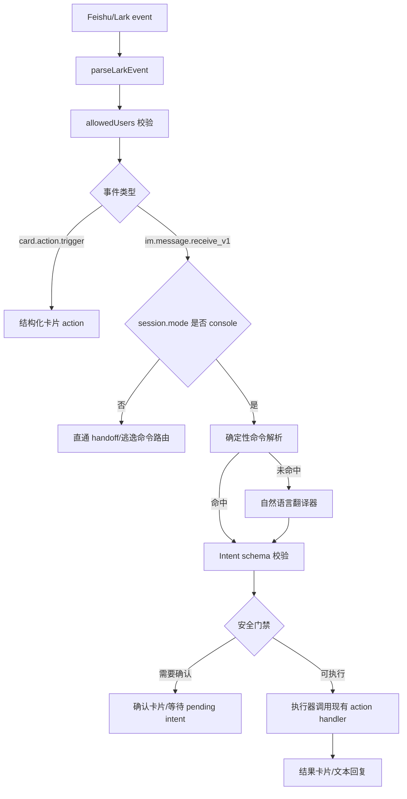

# 飞书自然语言意图翻译设计方案

日期：2026-05-13

## 背景

当前 Lark Remote 已经支持从飞书/Lark 端通过卡片和命令接管本机所有 Codex 项目与
窗口。这个模型稳定、可审计，但交互仍然偏“命令式”：用户需要知道 `takeover`、
`windows`、`observe`、`handoff off` 等固定入口。

新的设想是：用户在飞书里打开一个专门的控制窗口，直接输入自然语言，例如“看看现在
有哪些项目可以接管”“接管第二个项目里正在跑的那个窗口”“先观察一下刚才那个”。这个
窗口先把自然语言翻译成插件可理解的结构化调用结果，再由插件执行对应动作。

这份文档设计完整实现方案。核心原则是：自然语言只负责表达意图，插件仍然掌握执行权、
权限校验和状态机。

## 目标

1. 支持一个或多个飞书控制台会话，用户可以用自然语言操作 Lark Remote。
2. 把自然语言翻译成严格的结构化意图，而不是直接拼接命令或直接执行自由文本。
3. 复用现有项目列表、窗口列表、观察、接管、handoff、状态查询和启动介绍能力。
4. 所有控制台消息必须经过 `lark.allowedUsers` 校验。
5. 高影响操作必须二次确认，例如执行接管、关闭 handoff、取消任务、批准提交或推送。
6. 卡片按钮仍然走结构化 action，不需要经过自然语言翻译。
7. 翻译结果低置信度或上下文不足时，机器人应该追问或返回候选卡片，而不是猜测执行。

## 非目标

- 不让飞书端绕过 Codex 的审批、沙箱和本地权限机制。
- 不把自然语言直接作为 shell、Codex CLI 参数或内部 action payload 执行。
- 不要求飞书开放平台提供额外 AI 能力；翻译层由本地 bridge 调用专用 Codex 翻译线程完成。
- 不依赖另一个飞书窗口自动调用插件。飞书窗口本质上是不同的 `chat_id`，路由和执行
  仍由本地 bridge 管理。
- 不在第一阶段替换现有命令和卡片。自然语言控制台是增强层，现有入口继续兼容。

## 术语

- **控制台会话**：被标记为自然语言控制台的飞书/Lark `chat_id`。这里的消息优先进入
  意图翻译器。
- **普通 handoff 会话**：飞书消息直接作为用户输入转发给当前 Codex thread 的会话。
- **意图**：插件内部可执行的结构化动作，例如 `takeover.list_projects`。
- **翻译器**：把自然语言、候选列表和当前状态转换成意图 JSON 的组件。当前实现只考虑
  本地规则和专用 Codex 翻译线程。
- **执行器**：现有 bridge action handler。它只接受通过 schema 校验的意图，不接受
  自由文本。

## 总体方案

飞书消息进入 bridge 后，先按会话类型分流：

1. 卡片回调：直接读取按钮 payload，执行现有结构化 action。
2. 直通 handoff 会话：默认继续转发给当前 Codex thread；只拦截少量本地逃逸命令。
3. 控制台会话：先做确定性命令解析；无法解析时进入自然语言意图翻译。

流程图：



关键边界：

- 翻译器只输出 JSON，不执行动作。
- 执行器只接受白名单 intent，不接受任意函数名。
- intent 参数必须引用当前状态里的候选项，例如项目 index、窗口 index、thread 前缀。
- 高影响 intent 生成 pending confirmation，用户点确认卡片后才执行。

## 用户体验

### 设置控制台

推荐提供两种入口：

1. 启动介绍卡片增加按钮：`设为控制台`。
2. 用户在飞书里发送：`控制台模式`、`开启自然语言控制台`。

成功后回复：

```text
已开启控制台模式。你可以直接说：
- 看看有哪些项目可以接管
- 进入第 2 个项目
- 观察刚才那个窗口
- 接管这个窗口
- 停止观察
```

控制台状态写入本地，不提交到仓库。

### 查询项目

用户输入：

```text
看看有哪些项目可以接管
```

翻译结果：

```json
{
  "schemaVersion": 1,
  "intent": "takeover.list_projects",
  "args": {},
  "confidence": 0.96,
  "needsConfirmation": false,
  "reason": "用户想查看可接管的 Codex 项目"
}
```

插件执行现有项目列表逻辑，返回两级选择卡片的顶层项目列表。

### 进入项目和选择窗口

用户输入：

```text
进入第二个项目
```

如果当前状态有项目候选列表，翻译为：

```json
{
  "schemaVersion": 1,
  "intent": "takeover.select_project",
  "args": { "selector": "2" },
  "confidence": 0.91,
  "needsConfirmation": false,
  "reason": "用户选择上一张项目列表中的第二项"
}
```

插件校验 `selector=2` 是否存在于当前控制台会话的项目候选快照。通过后返回该项目下
窗口列表。

### 接管窗口

用户输入：

```text
接管正在跑的那个窗口
```

如果当前项目窗口列表中只有一个 running 窗口，翻译为：

```json
{
  "schemaVersion": 1,
  "intent": "takeover.execute",
  "args": { "selector": "running" },
  "confidence": 0.87,
  "needsConfirmation": true,
  "reason": "用户想接管当前窗口列表中的运行中窗口"
}
```

插件不会立刻接管，而是回复确认卡片：

```text
我理解为：接管「codex-lark-remote / 深入扫描项目...」这个 Codex 窗口。

[确认接管] [先观察] [取消]
```

确认后才执行现有 takeover 流程。目标窗口如果仍在运行，进入 pending takeover，等
当前轮结束后自动激活 handoff。

### 普通任务输入

用户在控制台里输入：

```text
继续刚才那个线程，帮我检查测试为什么失败
```

存在 active handoff 时，可以翻译为：

```json
{
  "schemaVersion": 1,
  "intent": "chat.forward_to_handoff",
  "args": {
    "message": "帮我检查测试为什么失败"
  },
  "confidence": 0.82,
  "needsConfirmation": false,
  "reason": "用户想把后半句作为普通 Codex 输入发给当前 handoff"
}
```

如果没有 active handoff，应回复澄清卡片：

```text
当前没有已接管的 Codex 窗口。你想先：
[查看项目] [查看最近窗口] [取消]
```

### 接管后的直通模式

接管某个 Codex 窗口后，不应该让接管任务里的每一句普通消息都进入自然语言翻译器。
原因有三点：

1. 用户接管后的主要诉求是继续和 Codex 写任务，普通文本应该原样进入目标 thread。
2. 每条任务消息都做 LLM 翻译会浪费延迟和成本。
3. 任务文本常常包含“查看”“执行”“取消”等词，如果交给控制台翻译，容易被误判成
   插件动作。

因此推荐把同一个飞书会话切到 `handoff` 直通模式：

```text
接管前：console mode
  自然语言 -> intent translator -> 插件动作

接管后：handoff mode
  普通消息 -> 当前 Codex thread
  少量逃逸命令 -> 本地控制动作
```

接管成功后的机器人提示应明确说明：

```text
已接管「深入扫描项目...」。
当前是任务对话模式：普通消息会直接发送给这个 Codex 窗口。

发送「控制台」或「跳出接管」可回到控制台，不会关闭当前接管。
发送「退出接管」会结束当前 Codex 会话接管，并回到外层自然语言控制台；飞书 WebSocket 和本地 bridge 仍保持连接。
发送「关闭飞书连接」会先发确认卡片；确认后停止本地 bridge 和飞书 WebSocket。
```

直通模式下只做低成本、确定性的逃逸命令识别，不调用 LLM：

```text
控制台 / 跳出接管 / 返回控制台
  -> session.mode = "console"，保留 activeHandoff

继续接管 / 回到任务
  -> session.mode = "handoff"，继续把普通消息发给 activeHandoff

退出接管 / 断开接管 / handoff off
  -> 关闭 activeHandoff，session.mode = "console"

关闭飞书连接 / 断开连接 / bridge stop
  -> 发确认卡片；确认后停止本地 bridge 和 WebSocket

状态 / status
  -> 返回当前 handoff 和 bridge 状态
```

这样可以同时保留两个能力：

- 任务对话时不浪费翻译，也不误伤用户输入。
- 用户需要重新选择项目、观察其他窗口或切换接管对象时，可以一条命令跳回控制台。

## 意图模型

### JSON schema

第一阶段建议使用小而硬的 schema：

```json
{
  "schemaVersion": 1,
  "intent": "takeover.list_projects",
  "args": {},
  "confidence": 0.93,
  "needsConfirmation": false,
  "reason": "一句话解释，不参与执行"
}
```

字段说明：

- `schemaVersion`：固定为 `1`。
- `intent`：白名单字符串。
- `args`：按 intent 定义的参数对象，禁止额外字段。
- `confidence`：`0` 到 `1`。
- `needsConfirmation`：翻译器建议值，最终仍由插件安全策略覆盖。
- `reason`：给用户和日志看的短解释，不能参与执行。

### 第一批 intent

系统类：

- `system.help`：展示命令卡片。
- `system.status`：查看 bridge、handoff、takeover、observer 状态。
- `identity.whoami`：返回当前飞书 sender id 和 allowlist 命中情况。
- `commands.show`：显示命令介绍。
- `commands.hide`：隐藏命令介绍。
- `unknown`：无法确定意图。
- `clarify`：需要用户补充选择。

handoff 类：

- `handoff.status`：查看当前 handoff。
- `handoff.disable`：关闭当前 handoff，需要确认。
- `chat.forward_to_handoff`：把消息发给当前已接管的 Codex thread。

接管类：

- `takeover.list_projects`：展示项目列表。
- `takeover.select_project`：进入某个项目。
- `takeover.list_windows`：展示当前项目窗口列表。
- `takeover.select_window`：查看某个窗口详情。
- `takeover.observe_window`：观察窗口。
- `takeover.execute`：接管窗口，需要确认。
- `takeover.cancel`：取消 pending takeover。
- `takeover.status`：查看接管状态。

观察类：

- `observation.status`：查看 observer 状态。
- `observation.start`：启动只读观察。
- `observation.stop`：停止观察。

任务类，后续阶段再接入：

- `task.status`：查看当前队列任务。
- `task.cancel`：取消任务，需要确认。
- `task.approve`：批准 gated action，例如 test、commit、push，需要沿用现有策略。

### 参数约束

每个 intent 的参数必须可验证：

```text
takeover.select_project:
  selector: string | number

takeover.select_window:
  selector: string | number

takeover.observe_window:
  selector?: string | number

takeover.execute:
  selector?: string | number

chat.forward_to_handoff:
  message: string
```

`selector` 只允许引用当前候选快照：

- 编号：`1`、`2`。
- thread 前缀：例如 `019e202d`。
- 状态别名：例如 `running`，但必须能唯一匹配。
- 最近选择：例如“刚才那个”，但必须存在 `lastSelectedWindow`。

如果匹配到多个目标，返回 `clarify`，并展示候选卡片。

## 翻译器设计

### 规则优先

第一阶段先做确定性规则，覆盖高频表达：

```text
看看有哪些项目可以接管 -> takeover.list_projects
列出窗口 -> takeover.list_windows
进入第二个项目 -> takeover.select_project selector=2
查看第 3 个窗口 -> takeover.select_window selector=3
观察这个 -> takeover.observe_window selector=last
接管这个 -> takeover.execute selector=last
停止观察 -> observation.stop
退出接管 -> handoff.disable
```

规则命中直接生成 intent，不调用 LLM，降低成本和延迟。

### Codex 翻译线程优先

“可插拔翻译器”不是用户侧概念，而是代码里的 adapter 边界：`intent-router` 不关心
自然语言到底由谁翻译，只接收一个经过 schema 校验的 intent JSON。

按这个产品设计，默认主路径应该直接走 Codex：

```text
飞书控制台自然语言
  -> 本地规则快速判断
  -> 专用 Codex 翻译线程
  -> intent JSON
  -> 插件校验和执行
```

这个 Codex 翻译线程和被接管的任务窗口不是同一个 thread。它只负责把“人话”翻译成
结构化 intent，系统提示会要求它只输出 JSON，不写代码、不改文件、不接管任务上下文。
这样不会污染正在工作的 Codex 任务窗口，也不会让任务窗口里的普通需求每次都承担翻译
成本。

代码入口可以保持为：

```text
src/intent-translator.mjs
  translateTextToIntent({ text, context, config })
```

这里的 `translator.provider` 只是内部选择“翻译后端”的字段。当前只保留两个值：

- `codex-thread`：默认主路径。调用专用 Codex 翻译线程，只产出 intent JSON。
- `rules`：只使用本地规则，适合离线、测试或最小实现。

第一版可以把这个配置隐藏起来，默认就是 `hybrid`：规则能识别就直接返回；规则识别
不了，再交给 `codex-thread`。暂时不设计单独配置 AI 服务的路径。

### 翻译 prompt 约束

Codex 翻译线程的 system prompt 必须强调：

- 只输出 JSON，不输出 Markdown。
- 只能使用白名单 intent。
- 不能发明 thread id、项目 id 或编号。
- 如果用户表达不清，输出 `clarify` 或 `unknown`。
- 如果动作高影响，设置 `needsConfirmation=true`。
- `reason` 只解释理解过程，不能包含秘密。

传给翻译器的上下文只包含必要信息：

```json
{
  "mode": "console",
  "activeHandoff": {
    "hasActive": true,
    "threadPrefix": "019e202d",
    "title": "深入扫描项目..."
  },
  "takeover": {
    "stage": "window_list",
    "lastProject": {
      "index": 1,
      "name": "codex-lark-remote"
    },
    "windows": [
      {
        "index": 1,
        "status": "idle",
        "threadPrefix": "019e202d",
        "title": "深入扫描项目..."
      }
    ]
  }
}
```

不传：

- `appSecret`
- verification token
- encrypt key
- 完整 thread id，除非执行器已经需要
- 用户消息历史全文
- 本地配置文件内容

## 状态设计

新增本地状态文件：

```text
~/.codex-lark-remote/intent-console.json
```

示例：

```json
{
  "version": 1,
  "consoleChats": [
    {
      "chatId": "oc_xxx",
      "chatIdHash": "chat_abc123",
      "enabledAt": "2026-05-13T10:00:00.000Z",
      "createdByUserHash": "user_def456"
    }
  ],
  "sessions": {
    "chat_abc123": {
      "stage": "project_list",
      "lastIntentAt": "2026-05-13T10:02:00.000Z",
      "lastProjectSelector": "1",
      "lastWindowSelector": null,
      "pendingIntent": null
    }
  }
}
```

说明：

- `chatId` 只存本地，用于主动推送和识别控制台。
- 日志只使用 `chatIdHash`。
- 候选列表不建议长期持久化；优先存短 TTL 快照，或复用现有 takeover selection state。
- `pendingIntent` 必须有过期时间，例如 5 分钟。

pending intent 示例：

```json
{
  "id": "intent_019e...",
  "intent": "takeover.execute",
  "args": { "selector": "1" },
  "createdAt": "2026-05-13T10:03:00.000Z",
  "expiresAt": "2026-05-13T10:08:00.000Z",
  "requiresUserHash": "user_def456"
}
```

确认卡片回调必须校验：

- pending intent 存在。
- 未过期。
- 点击用户仍在 `allowedUsers`。
- 点击用户与 `requiresUserHash` 一致，或配置允许同 allowlist 用户共同确认。
- 卡片 action id 与 pending intent id 匹配。

## 配置设计

在 `~/.codex-lark-remote/config.json` 增加可选段：

```json
{
  "intent": {
    "enabled": true,
    "mode": "hybrid",
    "consoleChatIds": [],
    "translator": {
      "provider": "codex-thread",
      "timeoutMs": 15000,
      "minConfidence": 0.75
    },
    "requireConfirmation": [
      "handoff.disable",
      "takeover.execute",
      "task.cancel",
      "task.approve"
    ],
    "fallbackToHandoff": true
  }
}
```

字段说明：

- `enabled`：总开关。
- `mode`：
  - `rules`：只用规则。
  - `codex`：所有自然语言都交给 Codex 翻译线程。
  - `hybrid`：规则优先，规则未命中时交给 Codex 翻译线程，推荐默认。
- `consoleChatIds`：预配置控制台会话。也可以通过卡片按钮动态写入本地状态。
- `translator.provider`：`codex-thread`、`rules`。默认推荐 `codex-thread`。
- `translator.minConfidence`：低于阈值时不执行。
- `requireConfirmation`：插件最终安全策略，不能只信翻译器。
- `fallbackToHandoff`：控制台里无法识别的长文本是否询问转发到 active handoff。

## 代码结构建议

新增模块：

```text
plugins/codex-lark-remote/src/intent-schema.mjs
plugins/codex-lark-remote/src/intent-translator.mjs
plugins/codex-lark-remote/src/intent-router.mjs
plugins/codex-lark-remote/src/intent-state.mjs
plugins/codex-lark-remote/src/intent-cards.mjs
```

职责：

- `intent-schema.mjs`
  - 定义 intent 白名单。
  - 校验参数 shape。
  - 根据安全策略标记是否必须确认。
- `intent-translator.mjs`
  - 规则解析。
  - 专用 Codex 翻译线程调用。
  - 规范化翻译结果。
- `intent-router.mjs`
  - 判断消息属于控制台、普通 handoff 还是命令。
  - 构造翻译上下文。
  - 把 intent 映射到现有 action。
- `intent-state.mjs`
  - 读写控制台 chat 状态。
  - 保存 pending intent。
  - 管理短期选择上下文。
- `intent-cards.mjs`
  - 生成“理解为”“需要确认”“需要澄清”的卡片。

现有模块改动方向：

- `bridge-server.mjs`
  - 在消息事件分发处接入 `intent-router`。
  - 卡片 action 继续直接走原有结构化 handler。
- `lark.mjs`
  - 保留事件解析和回复能力。
  - 尽量减少自然语言判断逻辑，把它迁到 `intent-translator`。
- `takeover*.mjs`
  - 保留项目、窗口、观察、接管能力。
  - 暴露给 intent executor 的接口保持结构化。

## intent 到现有 action 的映射

示例映射：

```text
system.status
  -> { kind: "status" }

identity.whoami
  -> { kind: "whoami" }

takeover.list_projects
  -> { kind: "takeover_list" }

takeover.select_project
  -> { kind: "takeover_project_select", selector }

takeover.list_windows
  -> { kind: "takeover_window_list", projectSelector }

takeover.select_window
  -> { kind: "takeover_window_view", selector }

takeover.observe_window
  -> { kind: "takeover_observe", selector }

takeover.execute
  -> { kind: "takeover_execute", selector }

observation.stop
  -> { kind: "observe_off" }

handoff.disable
  -> { kind: "handoff_off" }

bridge.stop
  -> { kind: "bridge_stop_confirm" }

chat.forward_to_handoff
  -> { kind: "handoff_message", message }
```

执行前统一调用：

```text
authorizeUser(event.senderId)
validateIntentSchema(intent)
resolveIntentArgs(intent, selectionState)
applySafetyPolicy(intent)
executeMappedAction(action)
```

## 安全策略

必须坚持四层门禁：

1. **用户门禁**：控制台模式必须要求非空 `lark.allowedUsers`。未配置 allowlist 时，
   拒绝自然语言控制台、项目列表和接管执行。
2. **schema 门禁**：翻译器输出必须通过 JSON schema 和 intent 白名单。
3. **状态门禁**：selector 只能解析到当前候选快照中的唯一目标。
4. **确认门禁**：高影响操作必须由卡片确认或明确文本确认触发。

高影响操作包括：

- 接管 Codex 窗口。
- 关闭 handoff。
- 取消正在执行或等待执行的任务。
- 批准 test、commit、push、review 等 gated action。
- 未来任何会写文件、提交代码或发送外部请求的动作。

日志策略：

- 记录 intent、confidence、执行结果和错误类别。
- 不记录 app secret、token、完整配置。
- 可以记录 thread prefix，但默认不记录完整 thread id。
- Codex 翻译调用失败时记录 timeout 和错误类别，不记录敏感上下文。

## 飞书卡片设计

### 理解确认卡片

用于低风险但用户表达可能有歧义的动作：

```text
我理解为：查看可接管项目

[执行] [显示命令] [取消]
```

### 高影响确认卡片

用于接管、关闭、取消、批准：

```text
确认接管 Codex 窗口？

项目：codex-lark-remote
窗口：深入扫描项目...
状态：running
说明：如果窗口还在运行，会等这一轮结束后自动接管。

[确认接管] [先观察] [取消]
```

### 澄清卡片

用于多个目标都符合自然语言：

```text
你想操作哪一个窗口？

1. [running] 修复 release 脚本
2. [idle] 补测试

[1] [2] [重新列出]
```

卡片 action payload 仍使用结构化 JSON：

```json
{
  "kind": "intent_confirm",
  "intentId": "intent_019e...",
  "decision": "confirm"
}
```

## 边界场景

### 控制台里说“第二个”

如果当前 stage 是 `project_list`，解释为第二个项目。

如果当前 stage 是 `window_list`，解释为第二个窗口。

如果没有候选上下文，回复澄清：

```text
我还没有可选列表。先查看项目还是查看窗口？
```

### 控制台里说“接管这个”

只有存在 `lastSelectedWindow` 时才允许解析。否则返回窗口列表。

### 翻译器低置信度

低于 `minConfidence` 时不执行，回复：

```text
我不确定你想做什么。你可以点下面的常用操作。
```

并附常用命令卡片。

### Codex 翻译线程超时

降级到规则结果。若规则也未命中，回复澄清卡片。

### 普通 handoff 和控制台冲突

同一个 `chat_id` 可以在 `console` 和 `handoff` 两种 session mode 之间切换，但同一
时刻只能有一个主路由：

- `console`：普通文本进入 intent router。
- `handoff`：普通文本直通当前 Codex thread，只拦截逃逸命令。

想直接给 Codex 发普通消息，可以在 `handoff` 模式下直接输入；如果当前处于
`console` 模式，也可以说：

```text
发送给当前线程：请继续修复测试
```

或点击“转发给当前接管线程”确认卡片。想从 `handoff` 模式回到控制台，则发送：

```text
控制台
```

## 实施阶段

### 阶段一：控制台模式和 Codex 翻译线程

目标：

- 支持 `控制台模式` 开关。
- 新增 intent schema、rules translator、Codex translator、intent router。
- 把现有命令映射到 intent，再映射回现有 action。
- 支持项目、窗口、观察、接管、状态、whoami、关闭 handoff。
- 接管成功后自动进入直通 handoff 模式，只保留确定性逃逸命令。
- 接管和关闭 handoff 必须确认。

收益：

- 使用 Codex 自己做语义翻译，不需要用户额外配置外部 AI 服务。
- 规则命中的高频命令不启动翻译线程，保持低延迟。
- 能先验证“自然语言入口 + Codex 翻译 + 状态机 + 确认卡片”的整体体验。

### 阶段二：翻译线程稳定性

目标：

- 固化专用 Codex 翻译线程的创建、复用和超时策略。
- 增加 fake Codex translator 测试。
- 加入超时、低置信度、非法 JSON、非法 intent 的降级。

### 阶段三：更强上下文理解

目标：

- 支持“刚才那个”“正在跑的那个”“最新的窗口”等上下文表达。
- 支持把自然语言任务转发给 active handoff。
- 支持多目标澄清卡片。

### 阶段四：任务和审批

目标：

- 将 queued task、test、commit、push、review 等 gated action 纳入 intent。
- 所有审批动作继续遵循现有 policy 和 Codex 本地权限。
- 形成远程“控制台 + 执行进度 + 审批确认”闭环。

## 测试计划

新增测试：

```text
test/intent-schema.test.mjs
test/intent-translator.test.mjs
test/intent-router.test.mjs
test/intent-state.test.mjs
test/bridge-server-intent.test.mjs
```

覆盖点：

- allowedUsers 为空时拒绝控制台。
- 未授权用户不能开启控制台、翻译、执行或确认 pending intent。
- 规则解析常见中文表达。
- 低置信度不执行。
- Codex 翻译返回非法 JSON 不执行。
- Codex 翻译返回未知 intent 不执行。
- selector 多目标匹配时返回澄清。
- 接管、关闭、取消、批准动作必须生成确认卡片。
- pending intent 过期后不能确认。
- 卡片按钮仍然绕过自然语言翻译，直接执行结构化 action。
- 普通 handoff 会话不被控制台规则误拦截。

## 推荐结论

这个模式是可行的，但建议实现为“飞书控制台会话 + 本地意图翻译器 + 插件执行器”的
三层结构，而不是让另一个飞书窗口直接执行插件能力。

第一阶段直接使用“规则快速判断 + Codex 翻译线程”。这样可以把控制台状态、权限、
确认卡片和现有 action 映射跑通，同时不需要用户额外配置单独的 AI 服务。

最终用户体验应该是：

```text
用户：看看有哪些项目可以接管
机器人：返回项目卡片

用户：进入第二个
机器人：返回项目内窗口卡片

用户：接管正在跑的那个
机器人：确认接管卡片

用户：点击确认接管
机器人：进入 pending 或 active handoff
```

插件内部始终只执行经过校验的结构化意图。自然语言负责“说人话”，本地 bridge 负责
“守边界和执行”。
