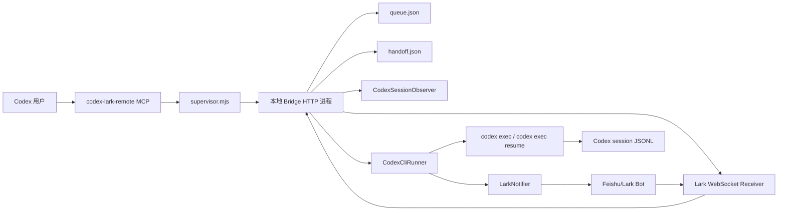
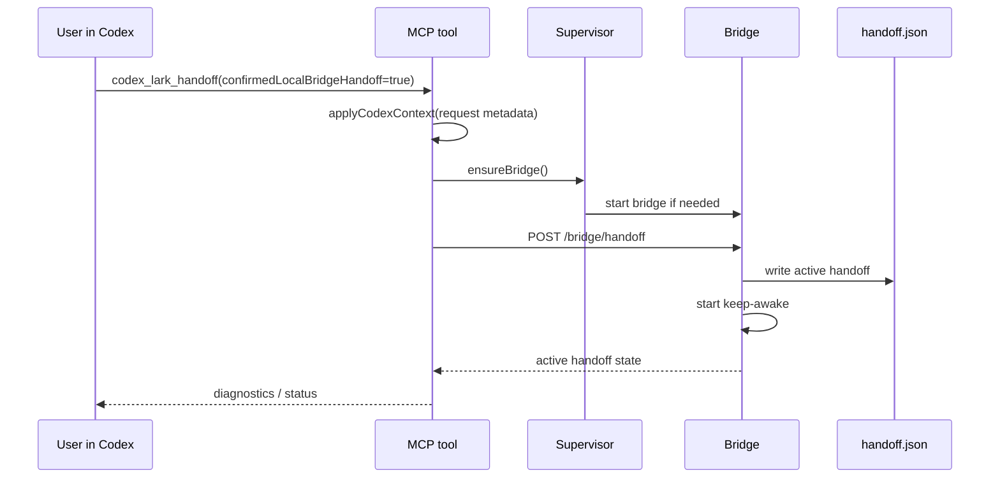
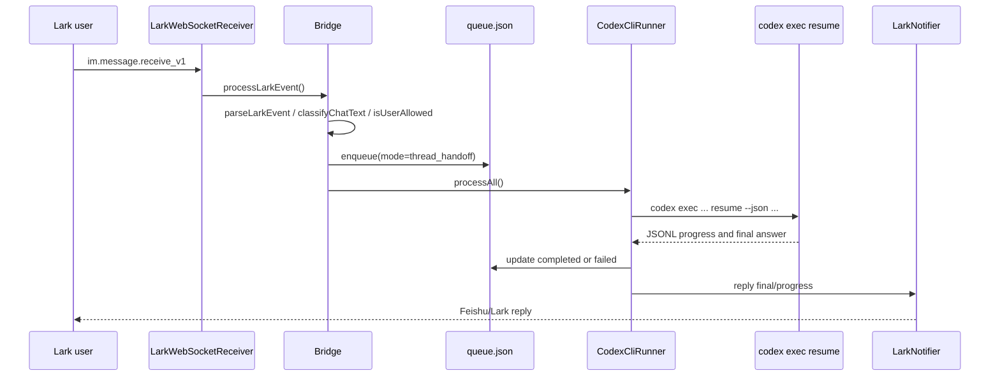
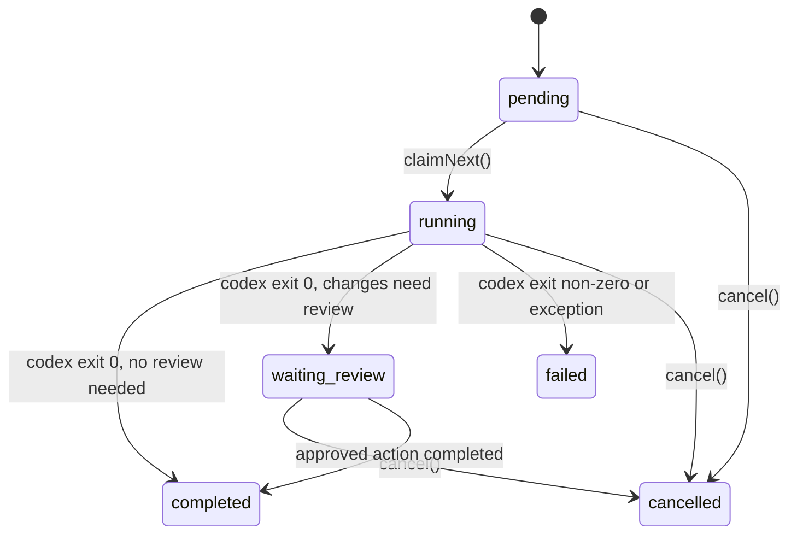

# Lark Remote 技术架构

本文面向后续接手 `codex-lark-remote` 的开发者，说明这个插件的主要代码逻辑、运行时数据、消息链路和安全边界。

## 目标和边界

`codex-lark-remote` 的目标是让用户可以从飞书/Lark 继续一个 Codex 对话，或者把飞书/Lark 里的任务交给 Codex 在本地仓库中执行。

它做的是“本地桥接”和“对话输入输出路由”，不是远程桌面，也不是 Codex Desktop UI 的替代品。因此它不能点击 Codex Desktop 的权限弹窗、MCP 审批弹窗、沙箱提权确认或其他原生 UI。遇到这些边界时，插件应把需要用户介入的信息发回飞书/Lark，而不是让远端用户误以为任务卡死。

核心能力分为四类：

1. 配置和诊断飞书/Lark 应用凭证。
2. 启动本机 bridge，接收 Lark 消息并回复结果。
3. 将当前 Codex 对话绑定为 `thread_handoff`，让 Lark 消息通过 `codex exec resume` 进入同一个线程。
4. 由飞书/Lark 端按“项目 -> 窗口”两级列表选择任意本机 Codex 窗口，观察或确认接管。
5. 在未绑定当前线程时，以 worktree 任务模式执行远程任务，并在 Lark 中进行状态查询、取消和审批。

## 仓库结构

```text
.
├── README.md
├── README.zh-CN.md
├── .codex-plugin/plugin.json
├── .mcp.json
├── assets/
├── bin/
│   ├── codex-lark-bridge.mjs
│   └── codex-lark-remote-mcp.mjs
├── config/example.config.json
├── docs/
│   ├── technical_architecture.zh-cn.md
│   └── cross_thread_takeover_design.zh-cn.md
├── package.json
├── skills/codex-lark-remote/SKILL.md
├── src/
│   ├── actions.mjs
│   ├── bridge-server.mjs
│   ├── codex-context.mjs
│   ├── config.mjs
│   ├── config-writer.mjs
│   ├── crypto.mjs
│   ├── diagnostics.mjs
│   ├── handoff.mjs
│   ├── keep-awake.mjs
│   ├── lark.mjs
│   ├── lark-ws.mjs
│   ├── notifier.mjs
│   ├── observer.mjs
│   ├── presenter.mjs
│   ├── prompt.mjs
│   ├── queue.mjs
│   ├── runner.mjs
│   ├── sanitize.mjs
│   ├── setup-guide.mjs
│   └── supervisor.mjs
└── test/
    ├── bridge-server.test.mjs
    ├── codex-context.test.mjs
    ├── diagnostics.test.mjs
    ├── handoff.test.mjs
    ├── lark.test.mjs
    ├── lark-ws.test.mjs
    ├── queue.test.mjs
    ├── runner.test.mjs
    └── ...
```

仓库根目录就是可安装的 Codex 插件根目录，和 Wakeflow 一样直接在根目录放置 `.codex-plugin/plugin.json`、`.mcp.json`、`skills/`、`bin/` 和 `src/`。README 同时服务 GitHub、marketplace 和插件安装后的说明入口。

## 运行时总览



插件运行时有两个主要进程：

- MCP stdio 进程：由 Codex 插件系统启动，暴露 `codex_lark_*` 工具。
- Bridge 进程：由 MCP 工具按需拉起，常驻本机，负责 Lark 事件、任务队列、handoff 状态、observer 和 runner。

MCP 进程偏控制面，bridge 进程偏数据面。这样的拆分可以让 Codex 工具调用很快返回，同时让 Lark 长连接和任务执行在后台持续运行。

## MCP 进程

入口文件是 `bin/codex-lark-remote-mcp.mjs`。它实现了 MCP 的 `initialize`、`tools/list` 和 `tools/call`。

当前暴露的工具包括：

| 工具 | 用途 |
| --- | --- |
| `codex_lark_configure` | 写入或更新本地运行配置。会返回脱敏摘要。 |
| `codex_lark_status` | 查询 bridge、queue、runner、handoff、observer 状态。 |
| `codex_lark_check_auth` | 用当前 Lark 凭证检查能否获取 tenant access token。 |
| `codex_lark_diagnose` | 返回可读诊断清单。 |
| `codex_lark_start` | 确保 bridge 启动。 |
| `codex_lark_handoff` | 在用户明确同意后，把当前 Codex 线程挂到 bridge。 |
| `codex_lark_prepare_takeover` | 在用户明确同意后启动 bridge，并把飞书接管控制权交给 Lark 端。 |
| `codex_lark_takeover_targets` | 诊断用：列出某个项目 cwd 下的可接管窗口。 |
| `codex_lark_takeover` | 诊断用：选择或执行某个窗口接管。 |
| `codex_lark_stop` | 停止 bridge。 |
| `codex_lark_history` | 查看近期队列任务。 |
| `codex_lark_task` | 查看单个任务。 |
| `codex_lark_send` | 手动向 bridge 创建任务。 |
| `codex_lark_cancel` | 取消任务。 |
| `codex_lark_approve` | 审批 test、commit、push、review 等受控动作。 |

`codex_lark_handoff` 是最敏感的工具。它要求 `confirmedLocalBridgeHandoff === true`，并通过 `applyCodexContext` 从当前 MCP 请求上下文中提取 Codex thread id、session path 和 cwd。当前实现不再按工作目录猜测“最近的 Codex 窗口”，这是为了避免同一仓库下多个 Codex 对话串线。

## Bridge 进程

入口文件是 `bin/codex-lark-bridge.mjs`，核心实现在 `src/bridge-server.mjs`。

`startBridge` 的启动步骤：

1. `loadConfig` 读取本地配置并合并默认值。
2. `assertLarkAppCredentials` 检查 Lark app id 和 secret。
3. 构造 `RemoteCommandQueue`、`LarkNotifier`、`CodexCliRunner`、`KeepAwakeController`、`CodexSessionObserver`。
4. 启动本地 HTTP server，默认监听 `127.0.0.1` 的随机端口。
5. 写入 `bridge-state.json`，包含 pid、version、url、token 和启动时间。
6. 启动 Lark WebSocket receiver。
7. 尝试发送启动介绍。若配置了 `startup.receiveId` 或曾记录最近已授权 `chat_id`，会立即主动推送；否则等待首条已授权 Lark 消息携带 `chat_id` 后补发并记录。
8. 如果已有 active handoff，启动 keep-awake；否则清理无效的 handoff 任务。
9. 恢复 observer。
10. 启动 takeover watcher，等待 running 窗口结束后激活 pending takeover。
11. 每 2 秒轮询一次 queue，让 runner 处理 pending 任务。

Bridge HTTP API 主要包括：

| 路径 | 说明 |
| --- | --- |
| `GET /bridge/status` | 返回运行状态、任务计数、handoff、observation、keep-awake、Lark WS 状态。 |
| `POST /bridge/stop` | 停止 bridge。 |
| `POST /bridge/lark/start` | 启动或确认 Lark WebSocket receiver。 |
| `POST /bridge/lark/event` | Webhook 模式下接收 Lark 事件。 |
| `GET /bridge/tasks` | 列出队列任务。 |
| `POST /bridge/tasks` | 手动创建 worktree 任务。 |
| `GET /bridge/tasks/:id` | 查看任务详情。 |
| `POST /bridge/tasks/:id/cancel` | 取消任务。 |
| `POST /bridge/tasks/:id/approve` | 审批受控动作。 |
| `GET /bridge/handoff` | 查看当前 handoff。 |
| `POST /bridge/handoff` | 激活 handoff。 |
| `DELETE /bridge/handoff` | 关闭 handoff。 |
| `GET /bridge/takeover` | 查看当前 takeover 状态。 |
| `POST /bridge/takeover/scope` | 准备 takeover 控制状态。 |
| `GET /bridge/takeover/targets` | 列出某个项目下的 Codex 窗口。 |
| `POST /bridge/takeover/select` | 选择窗口但不执行接管。 |
| `POST /bridge/takeover/execute` | 执行接管；running 窗口进入 pending。 |
| `POST /bridge/takeover/input` | pending takeover 期间拒绝输入；不会暂存或补发。 |
| `DELETE /bridge/takeover` | 清理 takeover 状态。 |

除 Lark webhook 入口外，`/bridge/*` 请求需要 `Authorization: Bearer <token>`。token 写在 `bridge-state.json`，由本地 MCP 进程读取并调用。

## 配置和运行时文件

默认数据目录为：

```text
~/.codex-lark-remote
```

可以通过 `CODEX_LARK_DATA_DIR` 覆盖数据目录，通过 `CODEX_LARK_CONFIG` 覆盖配置文件路径。

主要文件：

| 文件 | 作用 |
| --- | --- |
| `config.json` | 用户配置，包含 Lark 凭证、allowedUsers、runner、handoff、takeover、startup、policy、repos。不要提交。 |
| `bridge-state.json` | 当前 bridge 进程状态，供 MCP 进程寻找 bridge。 |
| `queue.json` | 任务队列和事件日志。 |
| `handoff.json` | 当前接管的 Codex thread id、session path、cwd、激活时间等。 |
| `takeover.json` | 飞书端项目/窗口选择、pending takeover、激活/取消等状态。 |
| `startup-notice.json` | 启动介绍的本地已发送标记和最近已授权 Lark 会话，避免 bridge 重启后重复刷屏，也支持后续启动主动推送。 |
| `observation.json` | 当前只读观察状态。 |
| `bridge.log` | bridge 子进程日志。 |
| `results/*.txt` | `codex exec resume -o` 写出的最终回答。 |
| `worktrees/*` | worktree 任务模式创建的临时工作树。 |

默认配置由 `src/config.mjs` 提供，重要默认值如下：

```js
{
  lark: {
    transport: "websocket",
    websocket: true,
    websocketStartTimeoutMs: 10000
  },
  runner: {
    sandbox: "workspace-write",
    ignoreUserConfig: true,
    skipGitRepoCheck: true,
    codexPath: "codex",
    timeoutMs: 30 * 60 * 1000,
    workerEnabled: true
  },
  handoff: {
    enabled: true,
    mode: "resume",
    promptStyle: "direct",
    notifyQueued: false,
    notifyStarted: true,
    notifyProgress: true,
    showCommands: false,
    keepAwake: true,
    keepAwakeCommand: "caffeinate",
    keepAwakeArgs: ["-dimsu"]
  },
  takeover: {
    enabled: true,
    projectLimit: 20,
    idleDebounceMs: 3000,
    pollIntervalMs: 1000,
    maxPendingInputs: 20,
    selectionTtlMs: 10 * 60 * 1000
  },
  startup: {
    enabled: true,
    once: true,
    rememberLastChat: true,
    receiveId: "",
    receiveIdType: "chat_id"
  },
  policy: {
    requireReviewForCommit: true,
    requireReviewForPush: true,
    maxPromptChars: 4000,
    maxResultChars: 3000,
    allowNetwork: false
  }
}
```

`lark.domain` 用于选择开放平台域名；未配置时默认 `feishu`。`feishu` 对应 `https://open.feishu.cn`，
`lark` 对应 `https://open.larksuite.com`。REST OpenAPI 和 WebSocket SDK
必须使用同一域名，且 App ID/App Secret 必须来自对应平台。

## Handoff 主流程

### 从 Codex 里启动接管



`src/handoff.mjs` 会把接管状态写成：

```json
{
  "active": true,
  "mode": "resume",
  "threadId": "current-codex-thread-id",
  "threadPath": "/Users/.../.codex/sessions/.../rollout-...jsonl",
  "cwd": "/path/to/workspace",
  "name": "",
  "activatedAt": "2026-05-13T00:00:00.000Z",
  "activatedBy": "mcp",
  "source": "explicit",
  "remoteNoteSentAt": ""
}
```

### 从 Lark 发送普通消息



Lark 事件处理在 `src/bridge-server.mjs` 的 `processLarkEvent` 和 `handleChatAction` 中完成。

关键检查顺序：

1. 只处理 message 类型事件。
2. 用内存 `seenMessageIds` 去重，避免 WebSocket 重放。
3. 只接受文本消息，非文本消息会回复提示。
4. 再查 `queue.findByMessageId`，避免重启或并发时重复入队。
5. 用 `classifyChatText` 识别命令。
6. 除 `whoami` 外都必须通过 `allowedUsers` 检查。
7. 有 active handoff 时，普通消息进入 `enqueueHandoffTask`。
8. 无 active handoff 时，普通任务进入 worktree 模式。

## Runner 执行模型

`src/runner.mjs` 的 `CodexCliRunner` 是执行核心。它通过 `processAll` 串行 claim pending 任务，避免同一个 bridge 内多个 Codex 子进程同时消耗队列。

### Handoff 模式

Handoff 任务的 `mode` 为 `thread_handoff`。runner 会构造：

```text
codex exec \
  --ignore-user-config \
  --sandbox <sandbox> \
  -C <cwd> \
  resume \
  --json \
  --skip-git-repo-check \
  -o <dataDir>/results/<task-id>.txt \
  <threadId> \
  <prompt>
```

如果 `runner.model` 被配置，会追加 `-m <model>`。最终回答优先读取 `-o` 输出文件；如果文件不可用，则从 JSONL stdout 中提取最终 assistant message。

Handoff prompt 默认是用户原文。第一次远程消息会追加一段边界提示，提醒 Codex：Lark 不能点击原生 UI 权限弹窗，需要把审批要求明确发回 Lark。

当目标 Codex Desktop 会话仍在执行时，新的 Lark 消息不会热注入、不会排队，也不会暂存。bridge 会直接回复忙碌提示，要求用户在当前 Codex 轮次结束后重新发送。runner 在真正 `resume` 前还会做第二次忙碌检查，避免接管激活和桌面端执行发生竞态。

### Worktree 模式

非 handoff 任务会进入 worktree 模式。runner 会：

1. 从 `config.repos[repoKey]` 找到仓库路径。
2. 在 `dataDir/worktrees/<task-id>` 下创建 Git worktree。
3. 创建分支 `codex-lark/<task-id>`。
4. 用 `buildRunnerPrompt` 生成远程任务 prompt。
5. 执行 `codex exec --json --sandbox <sandbox> -C <worktreePath> <prompt>`。
6. 结束后读取 `git diff --stat` 和 `git diff --name-only`。
7. 有改动则进入 `waiting_review`，否则 `completed`；失败则 `failed`。

审批动作由 `src/actions.mjs` 处理，受 `policy.requireReviewForCommit` 和 `policy.requireReviewForPush` 控制。

## 队列和状态机

队列文件由 `src/queue.mjs` 管理。`RemoteCommandQueue` 使用读改写 JSON 的方式存储任务和事件，写入时先写临时文件再 rename。

任务常用字段：

| 字段 | 说明 |
| --- | --- |
| `id` | 任务 id，默认 `rcmd_<time>_<random>`。 |
| `source` | 当前主要为 `lark`。 |
| `mode` | `thread_handoff` 或 `worktree`。 |
| `presentation` | `chat` 或 `task`。 |
| `repoKey` | worktree 模式使用的仓库 key。 |
| `projectRoot` | 当前仓库路径或 handoff cwd。 |
| `prompt` | 交给 Codex 的实际 prompt。 |
| `normalizedTask` | 原始用户任务文本。 |
| `status` | `pending`、`running`、`waiting_review`、`completed`、`failed`、`cancelled`。 |
| `messageId` | Lark 消息 id，用于回复和去重。 |
| `chatIdHash` | chat id 的短 hash。 |
| `userIdHash` | sender id 的短 hash。 |
| `codexSessionId` | handoff 目标 thread id。 |
| `codexSessionPath` | handoff 目标 session JSONL path。 |
| `result` | 最终回答。 |
| `progressSummary` | 进度摘要。 |
| `diffSummary` | Git diff 统计。 |
| `error` | 错误摘要。 |



## 输出和摘要

输出格式由 `src/presenter.mjs` 和 `src/runner.mjs` 共同控制。

`runner` 从 `codex exec --json` 的 stdout 中解析事件：

- assistant 普通消息会被压缩成进度摘要。
- final answer 不作为进度重复发送，最终由 `formatFinal` 发送。
- 命令事件默认隐藏，除非 `handoff.showCommands === true`。
- 风险命令即使隐藏普通命令，也会以 `Warning:` 形式展示。
- 源码查看类输出会被摘要化，避免 Lark 里刷大段源码。
- 权限边界、审批失败、沙箱或 UI 需要用户处理时，优先转换成可读提示。

Lark 回复由 `src/notifier.mjs` 处理。它负责获取 token、调用回复接口，并把长文本拆成多条消息。

## 观察模式

观察模式由 `src/observer.mjs` 实现，和 handoff 分开。用户可以在 Lark 使用：

```text
observe
observe <序号|thread 前缀>
observe off
```

观察是只读的：它读取 Codex session JSONL 的新增事件，发送进度摘要到 Lark，但不会把 Lark 消息注入被观察的 Codex 线程。这样可以在不接管的情况下远程查看某个 Codex 会话进度。

## 安全边界

关键安全设计：

1. `allowedUsers`：除 `whoami` 外，Lark sender 必须在白名单中；全项目 takeover 还要求 allowlist 非空。
2. 本地 token：bridge HTTP API 默认绑定 `127.0.0.1`，并要求 bearer token。
3. 脱敏：配置摘要、状态和命令输出通过 `sanitize` 系列逻辑避免泄露 token、secret、password。
4. 显式 handoff：启动接管要求用户明确同意。
5. 精确线程绑定：当前 handoff 要求来自 Codex 上下文的 thread id，不按 cwd 猜测窗口。
6. Takeover 必须由 Lark 端显式选择项目和窗口；数字或按钮只改变状态，不会绕过确认。
7. Handoff 关闭会取消 pending/running 的同线程任务，避免关闭后继续向旧线程注入。
8. Lark webhook 支持 verification token、encryptKey 和签名校验。
9. Worktree 模式默认用独立分支，commit 和 push 可由 policy 强制审批。
10. Runner 默认使用 `--ignore-user-config`，减少本机用户配置带来的不可控差异。
11. Lark 无法代替 Codex Desktop UI 审批，必须把审批边界向用户说明清楚。

## 主要模块职责

| 模块 | 责任 |
| --- | --- |
| `bin/codex-lark-remote-mcp.mjs` | MCP stdio server，暴露 Codex 工具。 |
| `bin/codex-lark-bridge.mjs` | bridge 子进程入口。 |
| `src/supervisor.mjs` | 读取 bridge state、启动/停止 bridge、向 bridge HTTP API 发请求。 |
| `src/bridge-server.mjs` | 本地 HTTP API、Lark 事件分发、handoff/observer/task 路由。 |
| `src/config.mjs` | 默认配置、路径解析、id/hash 工具。 |
| `src/config-writer.mjs` | 写入用户配置，返回脱敏摘要。 |
| `src/codex-context.mjs` | 从 MCP 请求元数据提取当前 Codex thread/cwd。 |
| `src/handoff.mjs` | 激活/读取/关闭 handoff，解析 Codex session 元数据。 |
| `src/takeover.mjs` | 项目列表、窗口列表、目标选择、pending takeover 和自动激活。 |
| `src/startup-notice.mjs` | 在 bridge 首次连接、handoff 或首条已授权 Lark 消息后推送命令介绍，并记录去重状态。 |
| `src/queue.mjs` | JSON 队列和事件日志。 |
| `src/runner.mjs` | 串行执行 queue 任务，调用 `codex exec` 或 `codex exec resume`。 |
| `src/lark.mjs` | Lark 事件解析、用户白名单、文本命令分类。 |
| `src/lark-ws.mjs` | Lark WebSocket 长连接。 |
| `src/notifier.mjs` | Lark token、消息回复和主动发送。 |
| `src/observer.mjs` | 只读观察 Codex session JSONL。 |
| `src/presenter.mjs` | 面向 Lark 的状态、任务、队列、最终结果文本。 |
| `src/diagnostics.mjs` | 诊断 bridge、配置、handoff 和 Lark 连接状态。 |
| `src/actions.mjs` | 受控执行 test、commit、push、review。 |
| `src/keep-awake.mjs` | macOS keep-awake，默认 `caffeinate -dimsu`。 |
| `src/crypto.mjs` | Lark webhook 加密和签名相关逻辑。 |
| `src/setup-guide.mjs` | 缺失 Lark 凭证时的用户指引。 |

## 测试策略

测试使用 Node 内置 test runner，根目录命令：

```bash
npm test
```

重点测试覆盖：

| 测试文件 | 覆盖内容 |
| --- | --- |
| `test/plugin-layout.test.mjs` | 插件包布局、metadata、README/skill 入口。 |
| `test/config-writer.test.mjs` | 配置写入和脱敏摘要。 |
| `test/codex-context.test.mjs` | 从 MCP 请求中提取 thread/cwd。 |
| `test/handoff.test.mjs` | handoff 激活、关闭、线程解析。 |
| `test/bridge-server.test.mjs` | bridge API、Lark 事件路由、handoff 状态。 |
| `test/lark.test.mjs` | Lark 消息解析、命令分类、权限判断。 |
| `test/lark-ws.test.mjs` | WebSocket receiver 行为。 |
| `test/queue.test.mjs` | 队列状态转换、去重、事件日志。 |
| `test/runner.test.mjs` | Codex CLI 参数构造、JSONL 摘要、最终回答提取。 |
| `test/diagnostics.test.mjs` | 诊断输出。 |
| `test/presenter.test.mjs` | Lark 文案格式。 |
| `test/actions.test.mjs` | 审批动作。 |

新增功能时建议先补纯函数测试，再补 bridge/server 级别测试。涉及 Lark API 的地方应使用 mock，避免测试依赖真实网络。

## 本地开发建议

常用命令：

```bash
npm test
npm run fixture
```

开发时可以用自定义数据目录隔离真实配置：

```bash
CODEX_LARK_DATA_DIR=/tmp/codex-lark-remote-dev npm test
```

调试 bridge 时优先查看：

1. `~/.codex-lark-remote/bridge-state.json`
2. `~/.codex-lark-remote/bridge.log`
3. `~/.codex-lark-remote/queue.json`
4. `~/.codex-lark-remote/handoff.json`

如果 bridge 状态异常，先用 `codex_lark_diagnose` 或 `codex_lark_status`，再判断是否需要 `codex_lark_stop` 后重新启动。

## 扩展点

### 增加 Lark 命令

1. 在 `src/lark.mjs` 的 `classifyChatText` 增加命令识别。
2. 在 `src/bridge-server.mjs` 的 `handleChatAction` 增加分支。
3. 在 `src/presenter.mjs` 增加可读回复。
4. 增加 `test/lark.test.mjs` 和 `test/bridge-server.test.mjs` 覆盖。

### 调整远程执行策略

Handoff 参数在 `buildCodexResumeArgs`，worktree 参数在 `buildCodexExecArgs`。改动时要同步更新 `test/runner.test.mjs`，并确认 `--json`、`-o`、`--skip-git-repo-check` 等行为没有破坏最终回答提取。

### 增加运行时状态

如果需要新增运行时文件，建议放在 `dataDir` 下，并在 `src/config.mjs` 增加路径函数。状态写入尽量采用“临时文件 + rename”的原子写模式，参考 `queue.mjs`。

### 支持新的接管能力

跨对话串流接管的设计见 [cross_thread_takeover_design.zh-cn.md](cross_thread_takeover_design.zh-cn.md)。当前实现已经升级为飞书端全项目接管：`windows` 先列出本机 Codex 项目，进入项目后列出项目内所有窗口，再由用户观察或确认接管。核心模块是 `src/takeover.mjs`、`src/bridge-server.mjs`、`src/presenter.mjs` 和 `src/lark.mjs`。

## 已知约束

- Lark 不能点击 Codex Desktop 原生审批 UI。
- 同一个 bridge 的 runner 当前串行执行队列任务。
- Handoff 依赖 Codex CLI `resume` 能接受 thread id 和 prompt。
- 进度串流依赖 Codex JSONL 输出和 session JSONL 事件，事件格式变化时需要适配。
- WebSocket 是默认传输；Webhook 模式需要用户自行处理公网回调地址。
- Worktree 模式要求目标 repo 已在 `config.repos` 中配置。
- 未配置 Lark 凭证时，插件只返回配置指引，不会启动 bridge。

## 快速定位表

| 问题 | 优先查看 |
| --- | --- |
| 工具列表或 MCP 调用异常 | `bin/codex-lark-remote-mcp.mjs` |
| bridge 启动失败 | `src/supervisor.mjs`、`src/bridge-server.mjs`、`bridge.log` |
| Lark 收不到消息 | `src/lark-ws.mjs`、`src/notifier.mjs`、Lark app 权限 |
| Lark 消息没有入队 | `src/lark.mjs`、`processLarkEvent`、`queue.json` |
| handoff 绑定错误 | `src/codex-context.mjs`、`src/handoff.mjs`、`handoff.json` |
| Codex resume 参数不对 | `src/runner.mjs` 的 `buildCodexResumeArgs` |
| 最终回复缺失 | `extractFinalMessage`、`results/*.txt`、`presenter.mjs` |
| 进度刷屏或太少 | `summarizeCodexEvent`、`presenter.mjs`、`handoff.showCommands` |
| 观察模式异常 | `src/observer.mjs`、`observation.json` |
| 安全或脱敏问题 | `src/sanitize.mjs`、`src/config-writer.mjs`、`presenter.mjs` |
